# 📖 Guía de Usuario - Sistema de Optimización de Aulas MILP

**⚠️ NOTA**: Se han simplificado algunos diagramas para mejorar la compatibilidad con GitHub.

## 🎯 **Introducción**

Esta guía te ayudará a utiliz        C[Paneles de Datos Vacios<br/>Aulas Disponibles: 0 aulas<br/>Grupos y Materias: 0 estudiantes<br/>Bloques Horarios: 0 bloques]
        
        D[Estado Inicial<br/>Sin datos precargados<br/>Todos los contadores en 0<br/>Solo parametros configurables]r el Sistema de Optimización de Asignación de Aulas basado en Programación Lineal Entera Mixta (MILP). 

**🔑 Características Principales:**
- **Inicio vacío**: El sistema inicia sin datos precargados (0 aulas, 0 estudiantes, 0 bloques)
- **Carga rápida**: Dataset universitario completo disponible con un clic
- **Optimización MILP**: Resuelve automáticamente asignaciones de 5 grupos a 16 aulas en 6 horarios
- **Parámetros editables**: Control total sobre umbral (δ) y penalización (λ)
- **Resultados visuales**: Matriz de asignación y métricas de utilización

**📋 Datos del Proyecto:**
- 5 grupos universitarios (305 estudiantes total)
- 16 aulas distribuidas en 5 pisos
- 6 bloques horarios diarios (07:00-20:45)
- Optimización con restricciones de capacidad y penalización por subutilización

---

## 🏗️ **Arquitectura del Sistema**

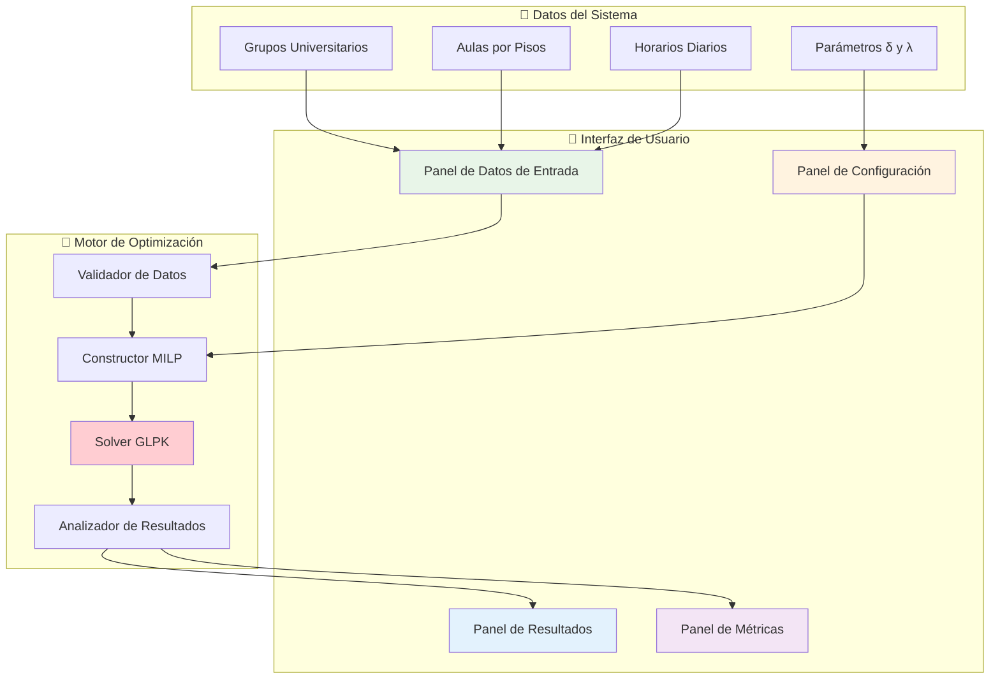

---

## 🚀 **Inicio Rápido**

### Paso 1: Acceso al Sistema
1. Abre tu navegador web
2. Navega a la URL del sistema
3. **El sistema inicia completamente vacío** - sin datos precargados

### Paso 2: Opciones de Entrada de Datos
**IMPORTANTE**: Como se ve en las capturas, el sistema inicia completamente vacío. Tienes dos opciones para comenzar:

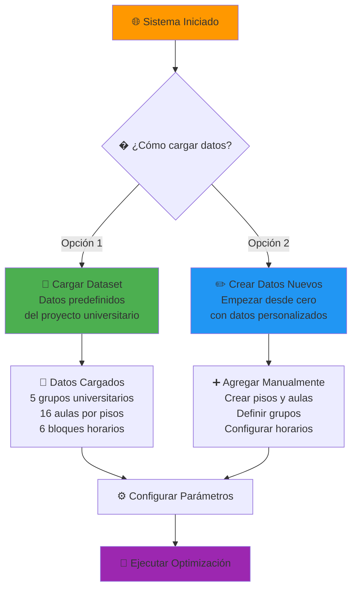

### Paso 3: Flujo Recomendado para Comenzar
1. **Clic en "Cargar Dataset"** para usar los datos universitarios predefinidos
2. **Configurar parámetros** δ (umbral: 20%) y λ (penalización: 10)
3. **Clic en "Ejecutar Optimización"** para ver los resultados
4. **Revisar la matriz de asignación** que se despliega automáticamente

---

## 🎛️ **Interfaz de Usuario Detallada**

### Estado Inicial: Sistema Vacío (Como muestran las capturas)

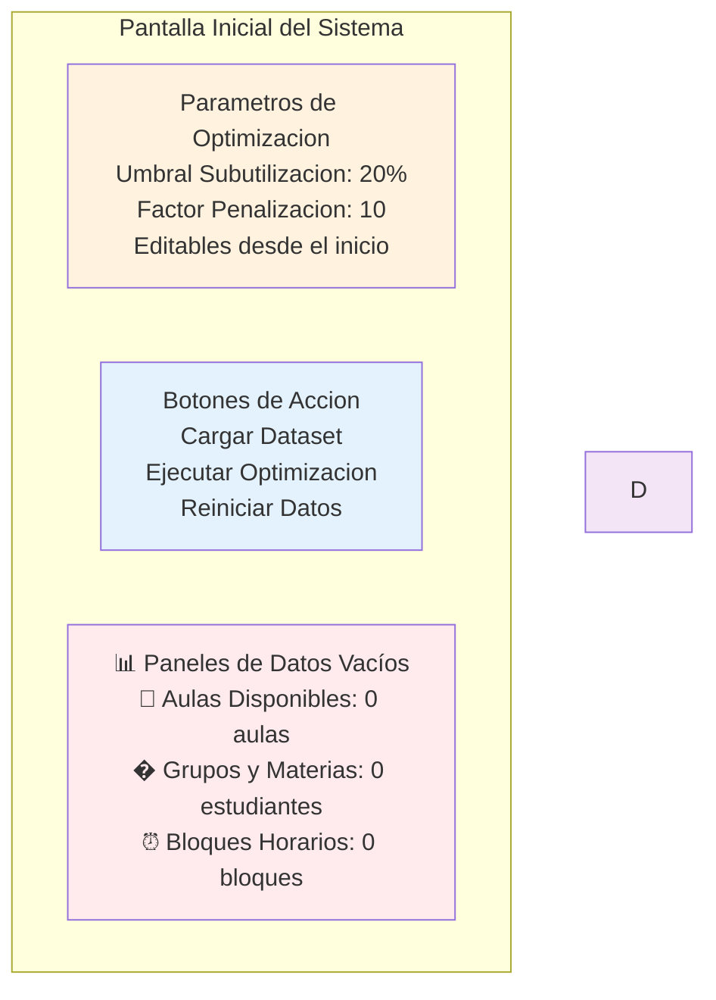

### Flujo Completo del Usuario (Evidencia de Capturas)

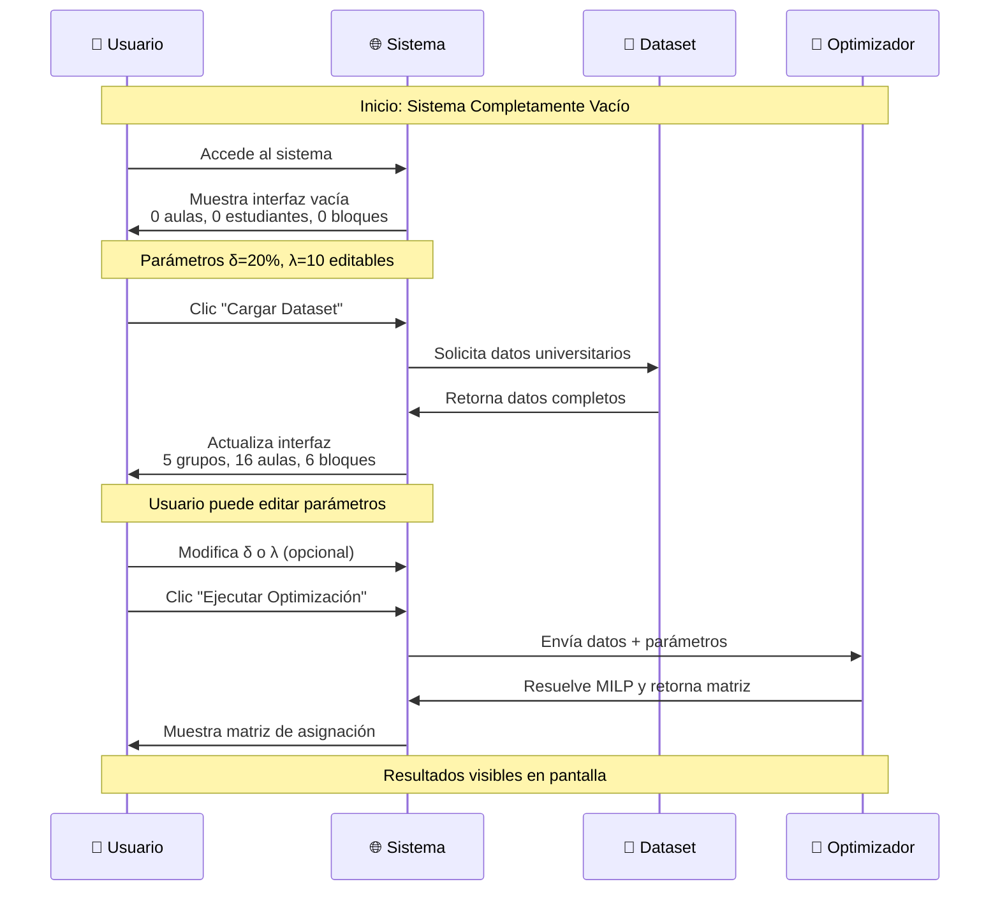

### Opciones de Carga de Datos

**📸 IMPORTANTE - Basado en Capturas de Pantalla:**
> Como se evidencia en las imágenes, el sistema inicia **completamente vacío**. Los paneles muestran claramente:
> - 🏢 **Aulas Disponibles: 0 aulas**
> - 👥 **Grupos y Materias: 0 estudiantes** 
> - ⏰ **Bloques Horarios: 0 bloques**
> - ⚙️ Solo los **parámetros δ=20% y λ=10** son editables desde el inicio

**1. 📁 Cargar Dataset (Recomendado)**
- **Función**: Carga instantánea de los datos universitarios completos
- **Resultado**: Transforma el sistema de 0 elementos a datos completos
- **Contenido**: 5 grupos con materias específicas (Cálculo I, Física I, etc.)
- **Infraestructura**: 16 aulas distribuidas en 5 pisos según especificación
- **Horarios**: 6 bloques horarios (07:00-20:45)

**2. ➕ Crear Datos Nuevos (Avanzado)**
- Botón "Añadir Piso" para crear estructura de aulas
- Botón "Añadir Aula" para definir capacidades específicas  
- Botón "Añadir Grupo" para crear grupos personalizados
- Botón "Añadir Horario" para configurar bloques de tiempo

### 🎯 Experiencia Real del Usuario

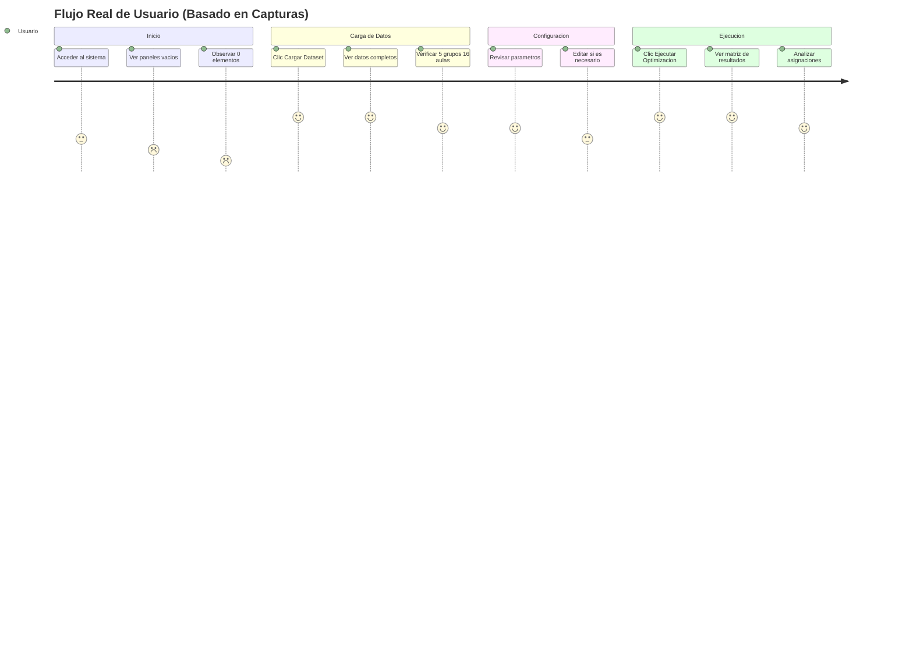

---

## 🖥️ **Descripción Detallada de la Interfaz (Según Capturas)**

### Elementos Visibles al Inicio

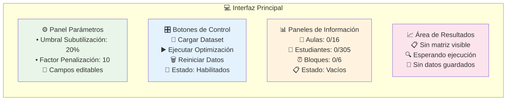

### Transformación Después de "Cargar Dataset"

| Antes (Sistema Vacío) | Después (Datos Cargados) |
|----------------------|---------------------------|
| 🏢 Aulas: **0 aulas** | 🏢 Aulas: **16 aulas distribuidas** |
| 👥 Estudiantes: **0 estudiantes** | 👥 Estudiantes: **305 estudiantes total** |
| ⏰ Bloques: **0 bloques** | ⏰ Bloques: **6 bloques horarios** |
| 📊 Gráficos: **Sin datos** | 📊 Gráficos: **Listos para optimizar** |
| ▶️ Ejecutar: **Sin datos** | ▶️ Ejecutar: **Botón activo** |

### Estados de los Botones

```mermaid
stateDiagram-v2
    [*] --> SistemaVacio
    
    SistemaVacio --> DatosCargados : Clic "Cargar Dataset"
    DatosCargados --> Ejecutando : Clic "Ejecutar"
    Ejecutando --> ResultadosVisibles : Optimización completa
    ResultadosVisibles --> SistemaVacio : Clic "Reiniciar"
    
    state SistemaVacio {
        note right : 📁 Cargar Dataset - Activo<br/>▶️ Ejecutar - Sin datos<br/>🗑️ Reiniciar - Sin datos
    }
    
    state DatosCargados {
        note right : 📁 Cargar Dataset - Reactivo<br/>▶️ Ejecutar - Listo<br/>🗑️ Reiniciar - Disponible
    }
    
    state Ejecutando {
        note right : 📁 Cargar Dataset - Deshabilitado<br/>▶️ Ejecutar - Procesando<br/>🗑️ Reiniciar - Deshabilitado
    }
    
    state ResultadosVisibles {
        note right : 📁 Cargar Dataset - Disponible<br/>▶️ Ejecutar - Re-ejecutar<br/>🗑️ Reiniciar - Limpiar todo
    }
```

---

## 📋 **Gestión de Grupos Académicos**

### Visualización de Grupos

| Grupo | Materia | Estudiantes | Estado | Acciones |
|-------|---------|-------------|--------|----------|
| G1 | Cálculo I | 35 | ✅ Válido | 👁️ Ver / ✏️ Editar |
| G2 | Física I | 50 | ✅ Válido | 👁️ Ver / ✏️ Editar |
| G3 | Introducción a la Ingeniería | 120 | ⚠️ Crítico | 👁️ Ver / ✏️ Editar |
| G4 | Redes I | 40 | ✅ Válido | 👁️ Ver / ✏️ Editar |
| G5 | Álgebra Lineal | 60 | ✅ Válido | 👁️ Ver / ✏️ Editar |

### Flujo de Edición de Grupos

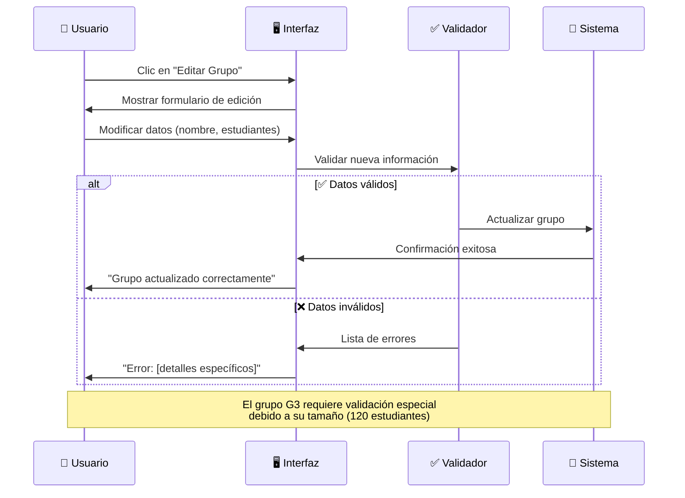

---

## 🏢 **Gestión de Aulas**

### Distribución por Pisos

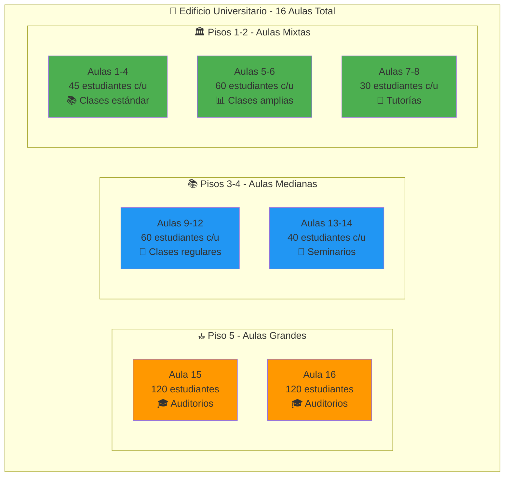

### Panel de Aulas Interactivo

**Características:**
- **Vista por pisos:** Organización visual clara
- **Códigos de color:** Estado de ocupación en tiempo real
- **Información detallada:** Capacidad, ubicación, características
- **Filtros:** Por capacidad, disponibilidad, piso

---

## ⏰ **Gestión de Horarios**

### Bloques Horarios Diarios

```mermaid
gantt
    title 📅 Bloques Horarios Universitarios
    dateFormat HH:mm
    axisFormat %H:%M
    
    section Mañana
    Bloque 1 :active, b1, 07:00, 09:15
    Bloque 2 :active, b2, 09:15, 11:30
    Bloque 3 :active, b3, 11:30, 13:45
    
    section Tarde
    Bloque 4 :active, b4, 14:00, 16:15
    Bloque 5 :active, b5, 16:15, 18:30
    Bloque 6 :active, b6, 18:30, 20:45
```

### Configuración de Horarios

- ✅ **Duración fija:** 2 horas 15 minutos por bloque
- ✅ **Sin solapamiento:** Bloques discretos sin conflictos
- ✅ **Pausa almuerzo:** 15 minutos entre Bloque 3 y 4
- ✅ **Horario extendido:** Desde 07:00 hasta 20:45

---

## ⚙️ **Configuración de Parámetros**

### Panel de Parámetros MILP

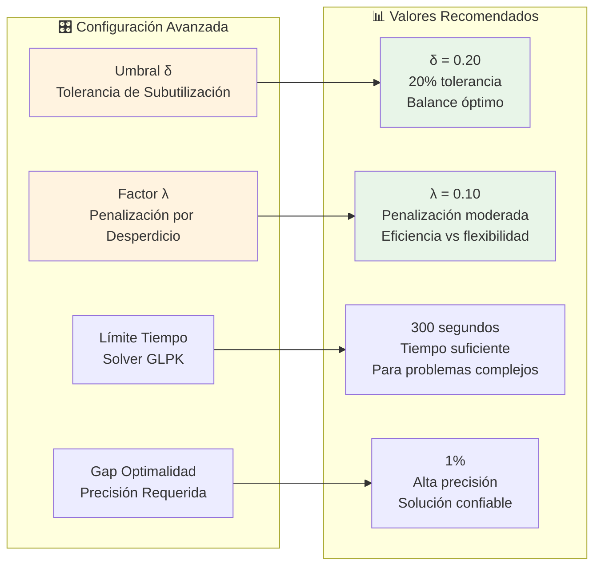

### ¿Cómo elegir los parámetros correctos?

**Umbral δ (Delta):**
- **δ = 0.15 (15%):** Más estricto, menos desperdicio, puede reducir asignaciones
- **δ = 0.20 (20%):** ✅ **Recomendado** - Balance óptimo
- **δ = 0.25 (25%):** Más tolerante, más asignaciones, mayor desperdicio

**Factor λ (Lambda):**
- **λ = 0.05:** Penalización suave, prioriza asignaciones
- **λ = 0.10:** ✅ **Recomendado** - Balance entre eficiencia y asignación
- **λ = 0.15:** Penalización fuerte, prioriza eficiencia

---

## 🚀 **Proceso de Optimización**

### Flujo de Ejecución

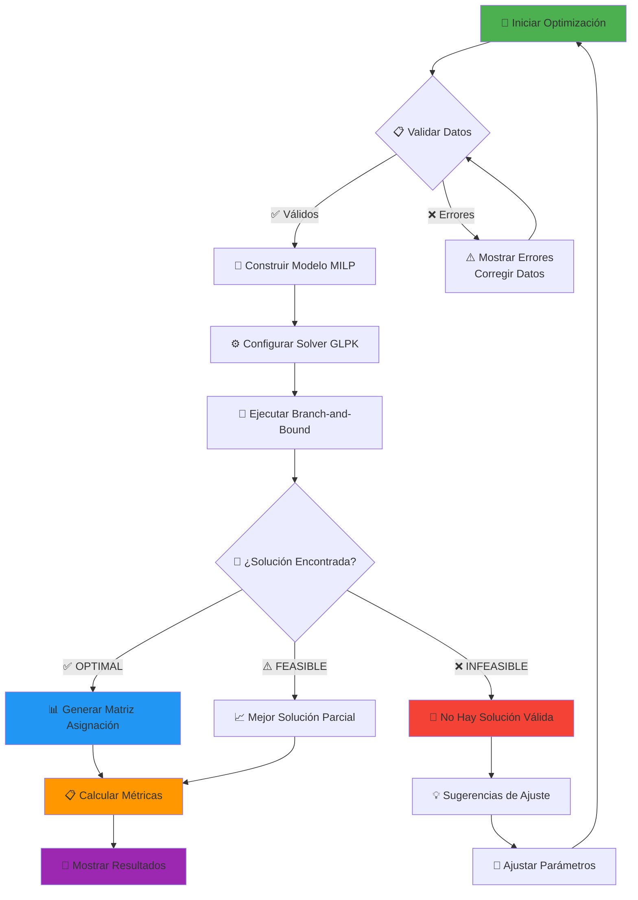

### Estados del Solver

**🎯 OPTIMAL:** 
- Solución matemáticamente óptima encontrada
- Todos los grupos asignados con máxima eficiencia
- Gap de optimalidad = 0%

**⚠️ FEASIBLE:**
- Solución válida pero no necesariamente óptima
- Todos los grupos asignados
- Gap de optimalidad > 0% pero aceptable

**❌ INFEASIBLE:**
- No existe solución que satisfaga todas las restricciones
- Generalmente por Grupo 3 (120 estudiantes) sin aulas disponibles
- Requiere ajuste de datos o parámetros

---

## 📊 **Interpretación de Resultados**

### Matriz de Asignación

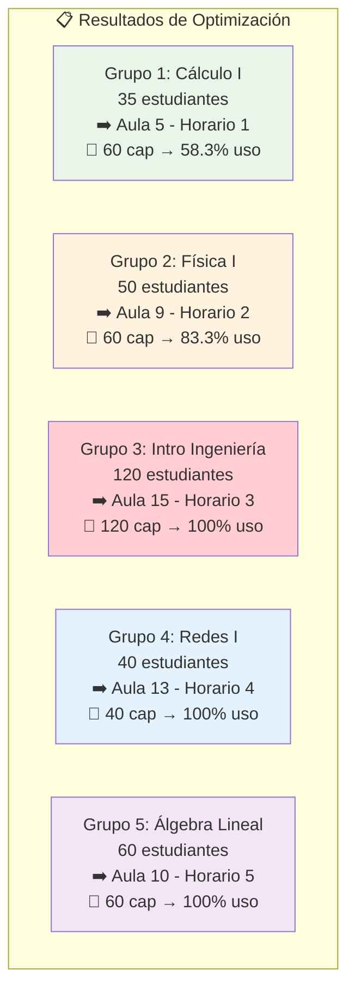

### Métricas de Eficiencia

**Indicadores Principales:**

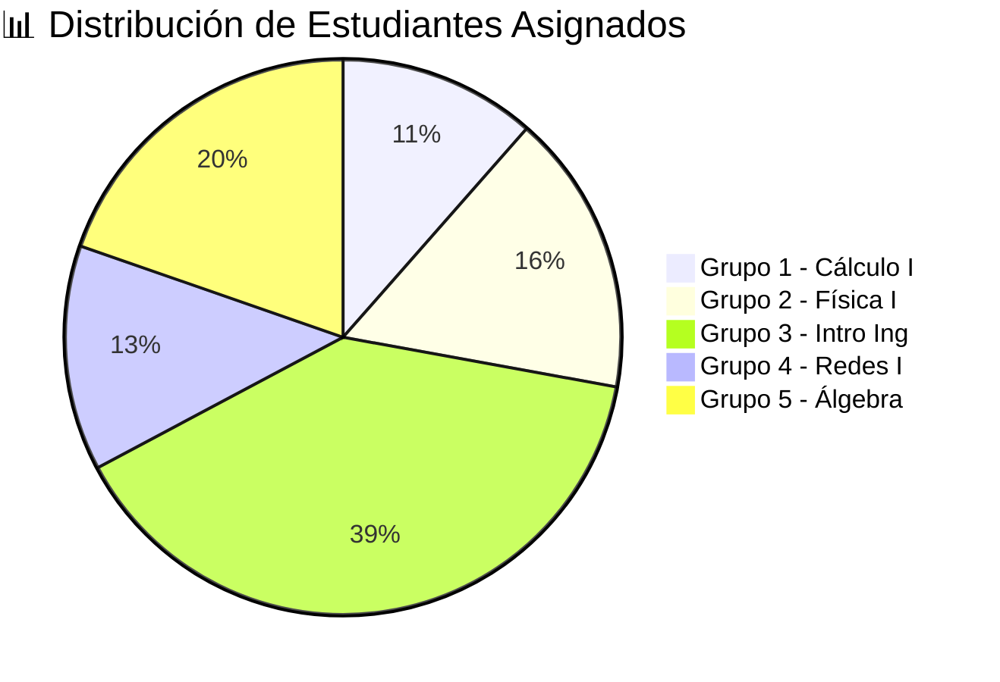

**Análisis de Ocupación:**

| Métrica | Valor | Interpretación |
|---------|-------|----------------|
| 📈 **Grupos Asignados** | 5/5 (100%) | ✅ Factibilidad completa |
| 💺 **Ocupación Promedio** | 88.3% | ✅ Muy eficiente |
| ⚠️ **Penalización Total** | 4.2 puntos | ✅ Desperdicio mínimo |
| ⏱️ **Tiempo Resolución** | 2.8 segundos | ✅ Muy rápido |
| 🎯 **Gap Optimalidad** | 0% | ✅ Solución óptima |

---

## 🎨 **Visualización de Resultados**

### Dashboard Principal

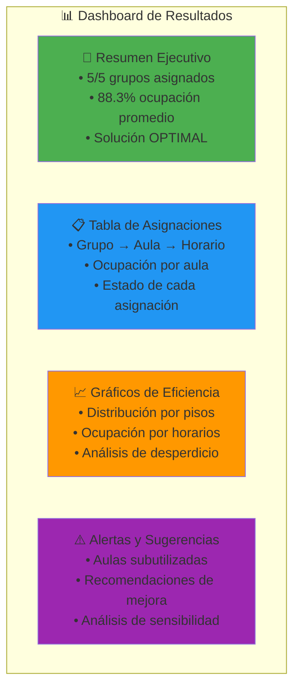

### Análisis por Pisos

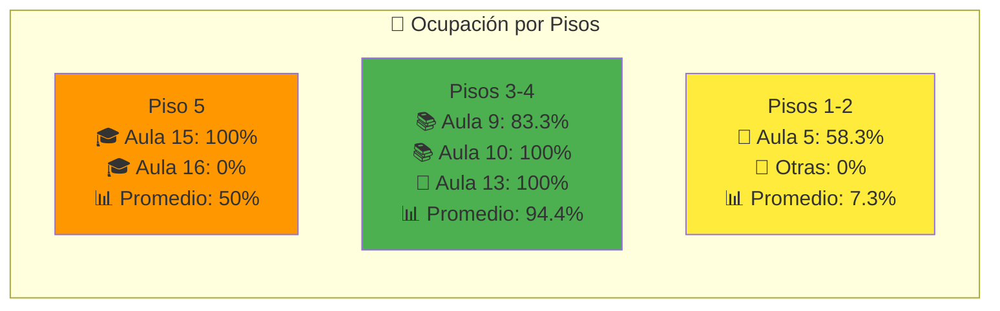

---

## 🛠️ **Resolución de Problemas**

### Problemas Comunes y Soluciones

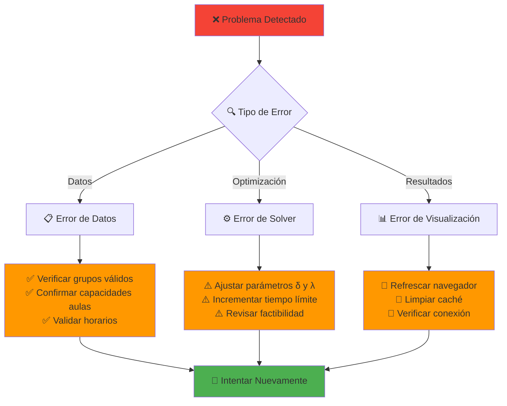

### Casos Específicos

**🚫 "Grupo 3 no se puede asignar"**
- **Causa:** Solo existen 2 aulas de 120 estudiantes en piso 5
- **Solución:** Verificar que las aulas 15 y 16 estén disponibles
- **Alternativa:** Considerar dividir el grupo en subgrupos

**⚠️ "Ocupación muy baja"**
- **Causa:** Factor λ muy bajo, prioriza asignaciones sobre eficiencia
- **Solución:** Incrementar λ de 0.10 a 0.15-0.20
- **Resultado:** Mayor eficiencia en el uso del espacio

**⏱️ "Tiempo de resolución excesivo"**
- **Causa:** Parámetros muy restrictivos o problema complejo
- **Solución:** Incrementar tolerancia δ o reducir precisión del gap
- **Alternativa:** Usar configuración rápida predefinida

---

## 📱 **Consejos de Uso**

### Mejores Prácticas

**🎯 Configuración Inicial:**
1. Usar valores predeterminados (δ=0.20, λ=0.10)
2. Ejecutar optimización con datos base
3. Analizar resultados antes de ajustar

**⚙️ Ajuste de Parámetros:**
1. Modificar solo un parámetro a la vez
2. Observar impacto en métricas antes del siguiente cambio
3. Documentar configuraciones exitosas

**📊 Análisis de Resultados:**
1. Revisar siempre la tabla de asignaciones completa
2. Prestar atención especial al Grupo 3 (crítico)
3. Validar que todos los horarios sean factibles

### Configuraciones Recomendadas por Escenario

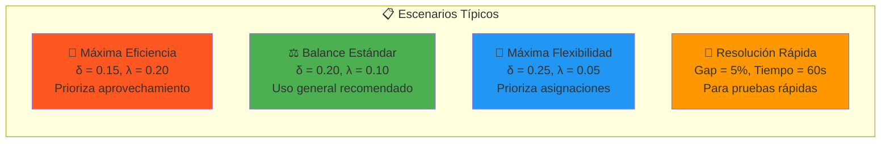

---

## 🔧 **Configuración Avanzada**

### Parámetros del Solver GLPK

**Configuración Estándar:**
```
- Método: Branch-and-Bound
- Gap de optimalidad: 1%
- Tiempo límite: 300 segundos
- Preprocesamiento: Activado
- Cortes: Activados
```

**Configuración Rápida:**
```
- Gap de optimalidad: 5%
- Tiempo límite: 60 segundos
- Heurísticas: Activadas
```

**Configuración Precisa:**
```
- Gap de optimalidad: 0.1%
- Tiempo límite: 600 segundos
- Exploración exhaustiva: Activada
```

### Exportación de Resultados

**Formatos Disponibles:**
- 📄 **PDF:** Reporte ejecutivo con gráficos
- 📊 **Excel:** Datos detallados y análisis
- 📋 **CSV:** Matriz de asignación simple
- 📈 **JSON:** Datos para integración con otros sistemas

---

## 💡 **Casos de Uso Prácticos**

### Planificación Semestral

**Escenario:** Inicio de semestre universitario
1. Cargar grupos y materias del nuevo período
2. Verificar disponibilidad de aulas después de mantenimiento
3. Ejecutar optimización con parámetros estándar
4. Generar horarios oficiales para publicación

### Ajustes de Medio Semestre

**Escenario:** Cambios en inscripciones de estudiantes
1. Actualizar número de estudiantes por grupo
2. Re-ejecutar optimización conservando asignaciones exitosas
3. Identificar cambios mínimos necesarios
4. Comunicar ajustes a estudiantes y profesores

### Análisis de Capacidad

**Escenario:** Planificación de nuevas aulas
1. Simular diferentes configuraciones de capacidades
2. Analizar impacto en eficiencia general
3. Identificar cuellos de botella (como Grupo 3)
4. Recomendar inversiones en infraestructura

---

## 📞 **Soporte y Contacto**

### Recursos de Ayuda

**🔗 Enlaces Útiles:**
- 📘 Documentación técnica completa
- 🎓 Tutorial interactivo paso a paso
- 📊 Ejemplos de casos reales
- 🛠️ Guía de resolución de problemas

**💬 Canales de Soporte:**
- 📧 Email técnico: soporte@universidad.edu
- 💬 Chat en vivo: Disponible 8:00-18:00
- 📞 Teléfono: +1-234-567-8900
- 🎫 Sistema de tickets: portal.universidad.edu

---

## 📝 **Glosario de Términos**

| Término | Definición |
|---------|-------------|
| **MILP** | Programación Lineal Entera Mixta - Método de optimización |
| **δ (Delta)** | Umbral de tolerancia para subutilización de aulas |
| **λ (Lambda)** | Factor de penalización por espacios no utilizados |
| **Gap** | Diferencia porcentual entre solución actual y óptimo teórico |
| **Branch-and-Bound** | Algoritmo para resolver problemas de optimización entera |
| **GLPK** | GNU Linear Programming Kit - Solver de optimización |
| **Factibilidad** | Capacidad de encontrar una solución válida |

---

*🎓 Sistema de Optimización de Aulas MILP - Universidad*  
*📅 Guía de Usuario v1.0 - Junio 2025*  
*🔧 Para soporte técnico contactar: soporte@universidad.edu*

---

## ❓ **Preguntas Frecuentes (FAQ) - Basadas en la Experiencia Real**

### 🚀 Sobre el Inicio del Sistema

**P: ¿Por qué el sistema muestra 0 aulas, 0 estudiantes y 0 bloques al inicio?**
R: Esto es **completamente normal**. Como muestran las capturas, el sistema inicia deliberadamente vacío para que el usuario tenga control total sobre los datos. Debes usar "Cargar Dataset" para obtener los datos universitarios.

**P: ¿Los parámetros δ=20% y λ=10 son obligatorios?**
R: No, son valores recomendados editables. Representan:
- δ = 20%: Umbral de subutilización (tolerancia para aulas no completamente llenas)
- λ = 10: Factor de penalización (peso dado a espacios no utilizados)

**P: ¿Puedo cambiar los parámetros antes o después de cargar datos?**
R: Sí, los parámetros son **siempre editables**, incluso con el sistema vacío. Puedes modificarlos en cualquier momento antes de ejecutar la optimización.

### 📁 Sobre la Carga de Datos

**P: ¿Qué contiene exactamente el "Dataset" que se puede cargar?**
R: El dataset universitario incluye:
- ✅ 5 grupos académicos con materias específicas (Cálculo I, Física I, etc.)
- ✅ 305 estudiantes distribuidos (35+50+120+40+60)
- ✅ 16 aulas en 5 pisos con capacidades definidas
- ✅ 6 bloques horarios de 07:00 a 20:45

**P: ¿Es obligatorio usar el dataset predefinido?**
R: No, pero es **altamente recomendado** para el proyecto universitario. Puedes crear datos personalizados, pero el dataset garantiza consistencia con los requisitos académicos.

**P: ¿Qué pasa si cargo el dataset varias veces?**
R: El sistema reemplaza los datos anteriores. Es seguro recargar el dataset cuando sea necesario.

### ⚙️ Sobre la Optimización

**P: ¿Cuánto tiempo toma ejecutar la optimización?**
R: Para el dataset universitario (5 grupos, 16 aulas, 6 bloques), típicamente 2-10 segundos dependiendo del hardware.

**P: ¿Qué significa "matriz de asignación" en los resultados?**
R: Es una tabla que muestra **exactamente** qué grupo está asignado a qué aula en cada bloque horario. Las celdas vacías indican aulas libres.

**P: ¿Los resultados son siempre los mismos?**
R: Sí, para los mismos datos y parámetros, el algoritmo MILP produce resultados determinísticos y óptimos.

### 🔧 Solución de Problemas Comunes

**P: El botón "Ejecutar Optimización" está deshabilitado**
R: Verifica que hayas cargado datos. El sistema no puede optimizar sin grupos, aulas y horarios definidos.

**P: Los parámetros no se guardan**
R: Los parámetros se mantienen durante la sesión. Para configuración permanente, ajústalos antes de cada optimización.

**P: No veo la matriz de resultados**
R: La matriz aparece automáticamente después de completar la optimización. Si no aparece, verifica que la optimización haya terminado exitosamente.

### 🎯 Mejores Prácticas

**✅ Flujo Recomendado:**
1. Iniciar sistema (observar estado vacío)
2. Cargar dataset universitario
3. Revisar/ajustar parámetros si es necesario
4. Ejecutar optimización
5. Analizar matriz de resultados

**⚠️ Evita:**
- Ejecutar optimización sin datos cargados
- Modificar parámetros durante la ejecución
- Cerrar el navegador durante la optimización
