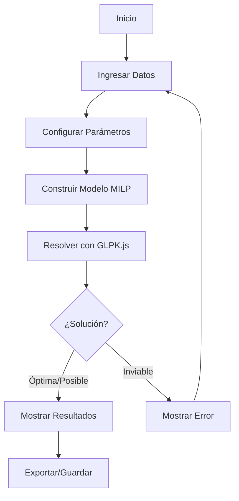

# Optimizador de Asignación de Aulas


Un sistema avanzado para la asignación óptima de aulas y horarios académicos mediante Programación Lineal Entera Mixta (MILP). Esta solución garantiza la asignación más eficiente de recursos educativos, maximizando la utilización de espacios y minimizando conflictos.

## 📊 Diagrama de Flujo del Algoritmo



## 🎯 Objetivo del Sistema

Maximizar la asignación de estudiantes a aulas disponibles, considerando:
- Capacidad de las aulas
- Disponibilidad de horarios
- Preferencias de asignación
- Minimización de espacios vacíos

## 🔢 Modelo Matemático

### Variables de Decisión

| Variable | Tipo | Descripción |
|----------|------|-------------|
| `x_ijt` | Binaria | 1 si el grupo i se asigna al aula j en el horario t |
| `U_ijt` | Continua | Espacio vacío en el aula j para el grupo i en el horario t |

### Función Objetivo

```
Maximizar: Σ (estudiantes_i * x_ijt) - Σ (penalización * U_ijt)
```

### Restricciones

1. **Asignación Única por Grupo**
   ```
   Σ_j Σ_t (x_ijt) ≤ 1  ∀i ∈ Grupos
   ```
   *Cada grupo se asigna como máximo a un aula y horario.*

2. **Una Asignación por Aula-Horario**
   ```
   Σ_i (x_ijt) ≤ 1  ∀j ∈ Aulas, ∀t ∈ Horarios
   ```
   *Cada combinación de aula-horario puede asignarse a un solo grupo.*

3. **Límite de Capacidad**
   ```
   estudiantes_i * x_ijt ≤ capacidad_j  ∀i,j,t
   ```
   *La cantidad de estudiantes no puede exceder la capacidad del aula.*

4. **Cálculo de Subutilización**
   ```
   U_ijt ≥ (capacidad_j - estudiantes_i - umbral) * x_ijt
   U_ijt ≥ 0
   ```
   *Calcula el espacio vacío penalizado cuando se asigna un grupo a un aula.*

## 🛠️ Implementación Técnica

### Estructura del Proyecto

```
src/
├── components/     # Componentes React reutilizables
├── hooks/          # Custom Hooks para lógica compartida
├── types/          # Definiciones de TypeScript
├── utils/          # Funciones de utilidad
└── App.tsx         # Componente principal
```

### Flujo de Datos

1. **Entrada de Datos**
   - Aulas con capacidades
   - Grupos con número de estudiantes
   - Bloques horarios
   - Parámetros de optimización

2. **Procesamiento**
   - Validación de datos
   - Construcción del modelo MILP
   - Resolución con GLPK.js
   - Análisis de resultados

3. **Salida**
   - Asignaciones óptimas
   - Métricas de desempeño
   - Visualización interactiva

## 📈 Métricas de Desempeño

- **Tasa de Asignación**: Porcentaje de grupos asignados exitosamente
- **Utilización Promedio**: Uso promedio de la capacidad de las aulas
- **Penalización Total**: Espacio vacío penalizado
- **Tiempo de Cálculo**: Tiempo de ejecución del algoritmo

## 🚀 Características

- Interfaz intuitiva y responsiva
- Visualización clara de asignaciones
- Ajuste en tiempo real de parámetros
- Exportación de resultados
- Persistencia de datos

## 📚 Documentación Técnica

### Instalación

```bash
# Clonar el repositorio
git clone https://github.com/tu-usuario/optimizacion-aulas.git

# Instalar dependencias
cd optimizacion-aulas
npm install

# Iniciar la aplicación
npm start
```

### Dependencias Principales

- React 18
- TypeScript
- GLPK.js
- Lucide Icons
- Vite

## 📝 Licencia

Este proyecto está bajo la Licencia MIT. Ver el archivo `LICENSE` para más detalles.

---

Desarrollado con ❤️ para la optimización de recursos educativos
