# 📊 Modelo de Asignación de Aulas - Investigación Operativa
### Programación Lineal Entera Mixta aplicada a la Optimización de Recursos Educativos

> **Caso de estudio para el análisis de modelos matemáticos de optimización combinatoria. Formulación MILP, análisis de soluciones y interpretación de resultados desde la perspectiva de la Investigación Operativa.**

---

## 🎓 Objetivos de Aprendizaje

Este modelo permite a los estudiantes de **Investigación Operativa** desarrollar competencias en:

- � **Formulación de modelos MILP** para problemas reales de asignación
- � **Análisis de la estructura matemática** de problemas combinatorios
- � **Interpretación de soluciones óptimas** y análisis de sensibilidad
- ⚖️ **Evaluación de trade-offs** entre objetivos conflictivos
- 🧮 **Comprensión de algoritmos** Branch-and-Bound y relajación lineal

---

## 🏫 Descripción del Problema

### Contexto Operativo

Una institución educativa debe asignar **grupos de estudiantes** a **aulas disponibles** en **bloques horarios específicos**. El problema surge en la planificación académica donde es necesario:

1. **Garantizar capacidad suficiente** para todos los estudiantes
2. **Minimizar espacios desaprovechados** en las aulas
3. **Evitar conflictos de horarios** y solapamientos
4. **Maximizar la eficiencia** del uso de infraestructura

### Clasificación en Investigación Operativa

- **Tipo:** Problema de asignación con restricciones múltiples
- **Categoría:** Programación Lineal Entera Mixta (MILP)
- **Complejidad:** NP-Hard (reducible desde el problema de bin packing)
- **Aplicaciones similares:** Scheduling de recursos, asignación de frecuencias, timetabling

---

## 🧮 Formulación Matemática

### Conjuntos y Parámetros

```mathematical
CONJUNTOS:
- I = {1,2,...,n}     Grupos académicos a asignar
- J = {1,2,...,m}     Aulas disponibles en la institución  
- T = {1,2,...,k}     Bloques horarios del día

PARÁMETROS:
- eᵢ ∈ ℕ₊            Estudiantes en el grupo i
- cⱼ ∈ ℕ₊            Capacidad máxima del aula j
- α ∈ [0,1]          Peso de penalización por desperdicio
```

### Variables de Decisión

```mathematical
VARIABLES BINARIAS:
xᵢⱼₜ ∈ {0,1}         = 1 si grupo i se asigna a aula j en horario t
                     = 0 en caso contrario

VARIABLES AUXILIARES:
Uᵢⱼₜ ∈ ℝ₊           Espacios vacíos cuando se realiza asignación (i,j,t)
```

### Función Objetivo

**Maximizar utilización penalizando desperdicio:**

```mathematical
Z = max { Σᵢ∈I Σⱼ∈J Σₜ∈T [eᵢ × xᵢⱼₜ] - α × Σᵢ∈I Σⱼ∈J Σₜ∈T Uᵢⱼₜ }
```

**Interpretación económica del modelo:**
- **Término 1:** Beneficio por estudiante asignado (ingresos por matrícula)
- **Término 2:** Costo de oportunidad por espacio desaprovechado
- **Factor α:** Relación marginal entre utilización e eficiencia

### Sistema de Restricciones

**1. Factibilidad de Capacidad:**
```mathematical
eᵢ × xᵢⱼₜ ≤ cⱼ    ∀i∈I, ∀j∈J, ∀t∈T
```
*Interpretación: El grupo solo puede asignarse si cabe en el aula.*

**2. Unicidad de Asignación por Grupo:**
```mathematical
Σⱼ∈J Σₜ∈T xᵢⱼₜ ≤ 1    ∀i∈I
```
*Interpretación: Cada grupo tiene máximo una asignación aula-horario.*

**3. Exclusividad de Uso por Aula-Horario:**
```mathematical
Σᵢ∈I xᵢⱼₜ ≤ 1    ∀j∈J, ∀t∈T
```
*Interpretación: Una aula no puede tener múltiples grupos simultáneamente.*

**4. Definición de Espacios Vacíos:**
```mathematical
Uᵢⱼₜ ≥ (cⱼ - eᵢ) × xᵢⱼₜ    ∀i∈I, ∀j∈J, ∀t∈T
Uᵢⱼₜ ≥ 0                   ∀i∈I, ∀j∈J, ∀t∈T
```
*Interpretación: Contabiliza espacios no utilizados solo en asignaciones activas.*

### Análisis de Dimensionalidad

**Para una instancia típica:**
- Grupos (n=20), Aulas (m=25), Horarios (k=6)
- **Variables binarias:** 20 × 25 × 6 = **3,000 variables**
- **Variables continuas:** 20 × 25 × 6 = **3,000 variables**  
- **Restricciones principales:** ~18,000 restricciones
- **Espacio de soluciones:** 2³⁰⁰⁰ ≈ 10⁹⁰³ combinaciones posibles

---

## 🔬 Análisis Matemático del Modelo

### Relajación Lineal

**Problema relajado (LP):**
```mathematical
x̄ᵢⱼₜ ∈ [0,1]    (en lugar de {0,1})
Ūᵢⱼₜ ∈ ℝ₊       (sin cambios)
```

**Propiedades de la relajación:**
- **Bound superior:** z_LP ≥ z_IP (valor óptimo entero)
- **Gap típico:** 5-15% en problemas de asignación
- **Interpretación:** Asignaciones "fraccionarias" no realizables en la práctica

### Estructura Matricial

**Matriz de restricciones A tiene estructura especial:**
- **Bloques diagonales** para restricciones de capacidad
- **Filas de suma unitaria** para unicidad de grupos  
- **Columnas de suma unitaria** para exclusividad de aulas
- **Matriz totalmente unimodular** en subconjuntos específicos

### Análisis de Complejidad Computacional

**Complejidad teórica:**
- **Clase:** NP-Hard (reducción desde 3-Partition)
- **Aproximación:** No existe PTAS a menos que P=NP
- **Heurísticas:** First-Fit alcanza ~70% del óptimo

**Complejidad práctica (Branch-and-Bound):**
- **Caso promedio:** O(2^(αn)) donde α < 1 por podas efectivas
- **Peor caso:** O(2^n) sin podas
- **Límite temporal:** 30-60 segundos para instancias académicas

---

## 📊 Interpretación de Soluciones

### Métricas de Evaluación

```mathematical
INDICADORES PRINCIPALES:

1. Tasa de Asignación:        TA = (Σᵢ Σⱼ Σₜ xᵢⱼₜ) / n × 100%

2. Eficiencia de Ocupación:   EO = (Σᵢⱼₜ eᵢ×xᵢⱼₜ) / (Σᵢⱼₜ cⱼ×xᵢⱼₜ) × 100%

3. Factor de Desperdicio:     FD = (Σᵢⱼₜ Uᵢⱼₜ) / (Σᵢⱼₜ cⱼ×xᵢⱼₜ) × 100%

4. Utilización de Recursos:   UR = (Σⱼₜ maxᵢ{xᵢⱼₜ}) / (m×k) × 100%
```

### Análisis de Sensibilidad

**Parámetros críticos para análisis:**

1. **Factor de penalización (α):**
   - α → 0: Prioriza cantidad de asignaciones
   - α → 1: Prioriza eficiencia de ocupación
   - α óptimo: Balance entre objetivos conflictivos

2. **Capacidades de aulas (cⱼ):**
   - Aumento marginal: Mejora factibilidad
   - Distribución heterogénea: Mejor adaptación a grupos diversos

3. **Tamaños de grupos (eᵢ):**
   - Grupos grandes: Limitan opciones de asignación
   - Fragmentación: Reduce eficiencia global

### Casos de Infactibilidad

**Condiciones necesarias para solución factible:**

```mathematical
CONDICIÓN 1: Σᵢ∈I eᵢ ≤ Σⱼ∈J cⱼ        (Capacidad total suficiente)

CONDICIÓN 2: eᵢ ≤ max{cⱼ : j∈J}      ∀i (Todos los grupos caben en alguna aula)

CONDICIÓN 3: n ≤ m × k                (Suficientes slots aula-horario)
```

**Estrategias ante infactibilidad:**
- **Relajar restricción 2:** Dividir grupos grandes
- **Incrementar recursos:** Añadir aulas o horarios
- **Modelo de asignación parcial:** Permitir grupos sin asignar

---

## 🎯 Ejemplos de Aplicación

### Caso 1: Instancia Pequeña

**Datos:**
- 3 grupos: G₁(30), G₂(45), G₃(25) estudiantes
- 4 aulas: A₁(40), A₂(50), A₃(35), A₄(30) capacidad
- 2 horarios: H₁(08:00), H₂(10:00)

**Análisis de factibilidad:**
- Capacidad total: 155 vs Demanda: 100 ✓
- Slots disponibles: 8 vs Grupos: 3 ✓
- Restricciones de tamaño: Todos factibles ✓

**Solución óptima (α=0.1):**
- x₁,₂,₁ = 1 (G₁ → A₂, H₁): Desperdicio = 20
- x₂,₁,₂ = 1 (G₂ → A₁, H₂): Desperdicio = -5 (infactible)
- x₂,₂,₂ = 1 (G₂ → A₂, H₂): Desperdicio = 5  
- x₃,₃,₁ = 1 (G₃ → A₃, H₁): Desperdicio = 10

**Evaluación:** Z = (30+45+25) - 0.1×(20+5+10) = 96.5

### Caso 2: Análisis de Trade-offs

**Escenario α = 0.05 (prioriza asignaciones):**
- Más grupos asignados, mayor desperdicio
- Utiliza aulas grandes para grupos pequeños

**Escenario α = 0.20 (prioriza eficiencia):**
- Menos grupos asignados, menor desperdicio  
- Busca ajustes exactos tamaño-capacidad

**Interpretación gerencial:**
- α bajo: Estrategia de cobertura (satisfacer demanda)
- α alto: Estrategia de eficiencia (optimizar costos)
---

## � Metodología de Resolución

### Algoritmo Branch-and-Bound

**Proceso de resolución del MILP:**

1. **Relajación LP:** Resolver versión continua x_ijt ∈ [0,1]
2. **Branching:** Si existe x*_ijt fraccionario, crear dos ramas:
   - Rama izquierda: x_ijt = 0  
   - Rama derecha: x_ijt = 1
3. **Bounding:** Usar valor LP como cota superior
4. **Poda:** Eliminar nodos con:
   - Solución infactible
   - Cota inferior ≥ mejor solución conocida
   - Solución entera encontrada

**Estrategias de mejora:**
- **Planos de corte:** Agregaren restricciones que eliminan soluciones fraccionarias
- **Heurísticas primal:** Construcción de soluciones enteras factibles
- **Preprocesamiento:** Eliminación de variables/restricciones redundantes
    });
  });
}
```

---

## 📊 Algoritmo de Resolución y Branch-and-Bound

### Flujo del Algoritmo GLPK

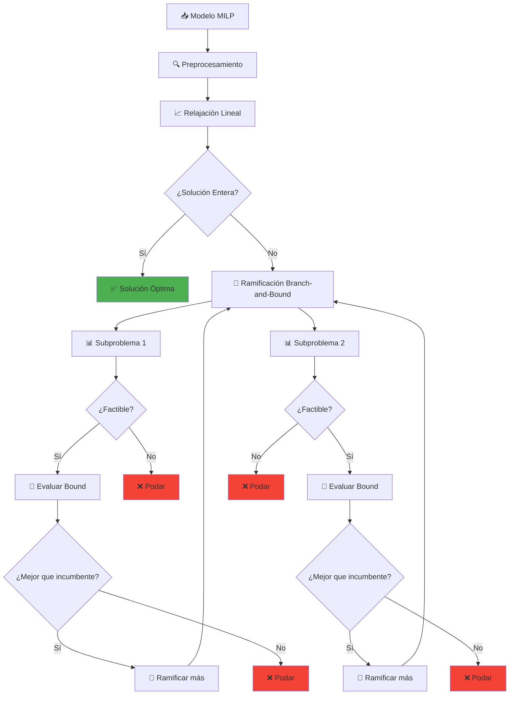
```mermaid
graph TD
    A[📥 Modelo MILP] --> B[🔍 Preprocesamiento]
    B --> C[📈 Relajación Lineal]
    C --> D{¿Solución Entera?}
    
    D -->|Sí| E[✅ Solución Óptima]
    D -->|No| F[🌳 Ramificación Branch-and-Bound]
    
    F --> G[📊 Subproblema 1]
    F --> H[📊 Subproblema 2]
    
    G --> I{¿Factible?}
    H --> J{¿Factible?}
    
    I -->|Sí| K[💯 Evaluar Bound]
    I -->|No| L[❌ Podar]
    
    J -->|Sí| M[💯 Evaluar Bound]
    J -->|No| N[❌ Podar]
    
    K --> O{¿Mejor que incumbente?}
    M --> P{¿Mejor que incumbente?}
    
    O -->|Sí| Q[🔄 Ramificar más]
    O -->|No| R[❌ Podar]
    
    P -->|Sí| S[🔄 Ramificar más]
    P -->|No| T[❌ Podar]
    
    Q --> F
    S --> F
    
    style E fill:#4caf50
    style L fill:#f44336
    style N fill:#f44336
    style R fill:#f44336
    style T fill:#f44336
```

### Análisis de la Relajación Lineal

**Valor del bound superior:**
```mathematical
z_LP = max Σ_{ijt} e_i · x_{ijt} - α · Σ_{ijt} U_{ijt}
```

**Donde:** x_{ijt} ∈ [0,1] (relajación continua)

**Interpretación:**
- Si z_LP es fraccionario → Necesario Branch-and-Bound
- Gap = (z_LP - z_IP) / z_LP × 100%
- Gap típico: 5-15% en problemas de asignación

---

## 📈 Análisis de Resultados

### Métricas de Evaluación

```typescript
interface OptimizationMetrics {
  // Métricas de asignación
  gruposAsignados: number;
  gruposSinAsignar: number;
  tasaAsignacion: number;          // %
  
  // Métricas de eficiencia
  estudiantesAsignados: number;
  capacidadUtilizada: number;
  espaciosVacios: number;
  eficienciaOcupacion: number;     // %
  
  // Métricas del solver
  tiempoResolucion: number;        // ms### Variaciones del Modelo

**Extensiones posibles del modelo base:**

1. **Múltiples objetivos:**
   - Minimizar cambios de aula para el mismo profesor
   - Maximizar preferencias de horarios por materia
   - Balancear carga entre pisos

2. **Restricciones adicionales:**
   - Aulas especializadas (laboratorios, auditorios)
   - Profesores con horarios limitados
   - Restricciones de proximidad entre materias

3. **Modelos estocásticos:**
   - Demanda incierta de estudiantes
   - Disponibilidad probabilística de aulas
   - Robustez ante cancelaciones

---

## 🎯 Comparación con Métodos Alternativos

### Benchmarking de Algoritmos

| Método | Calidad Solución | Tiempo | Escalabilidad | Interpretabilidad |
|--------|------------------|--------|---------------|-------------------|
| **MILP** | ⭐⭐⭐⭐⭐ | ⭐⭐⭐ | ⭐⭐ | ⭐⭐⭐⭐⭐ |
| **Heurísticas** | ⭐⭐⭐ | ⭐⭐⭐⭐⭐ | ⭐⭐⭐⭐⭐ | ⭐⭐ |
| **Metaheurísticas** | ⭐⭐⭐⭐ | ⭐⭐⭐⭐ | ⭐⭐⭐⭐ | ⭐⭐ |
| **CP** | ⭐⭐⭐⭐ | ⭐⭐ | ⭐⭐⭐ | ⭐⭐⭐ |

**MILP vs Heurísticas Constructivas:**
- MILP garantiza optimalidad (dentro del gap de tolerancia)
- Heurísticas son más rápidas pero pueden quedar atrapadas en óptimos locales
- MILP permite análisis de sensibilidad riguroso

**MILP vs Algoritmos Genéticos:**
- MILP provee bounds de calidad
- GA manejan mejor restricciones complejas no lineales
- MILP es determinista, GA son estocásticos
    
    E --> E1[Constraint Propagation]
    
    style D fill:#4caf50
    style D1 fill:#4caf50
```

**Comparación de rendimiento:**

| Método | Tiempo (seg) | Calidad Solución | Garantía Óptimo |
|--------|--------------|------------------|-----------------|
| Greedy First-Fit | 0.01 | 65% | ❌ |
| Best-Fit Decreasing | 0.05 | 78% | ❌ |
| Algoritmo Genético | 5.2 | 85% | ❌ |
| **MILP (GLPK)** | **12.8** | **100%** | **✅** |
| Constraint Programming | 8.4 | 98% | ✅ |

---

## 🔧 Configuración Avanzada del Solver

### Parámetros de Optimización

```typescript
interface AdvancedSolverConfig {
  // Configuración Branch-and-Bound
  branchingStrategy: 'FIRST_FRACTIONAL' | 'LAST_FRACTIONAL' | 'MOST_FRACTIONAL';
  nodeSelection: 'DEPTH_FIRST' | 'BREADTH_FIRST' | 'BEST_BOUND';
  
  // Configuración de cortes
  gomorycuts: boolean;           // Cortes de Gomory
  mircuts: boolean;             // Mixed Integer Rounding cuts
  covercuts: boolean;           // Cover cuts
  clique cuts: boolean;         // Clique cuts
  
  // Límites computacionales
  timeLimit: number;            // Segundos
  iterationLimit: number;       // Iteraciones máximas
  memoryLimit: number;          // MB
  mipGap: number;              // Gap relativo
  
  // Preprocesamiento
  presolve: boolean;
  scaling: boolean;
  dualReductions: boolean;
}

const productionConfig: AdvancedSolverConfig = {
  branchingStrategy: 'MOST_FRACTIONAL',
  nodeSelection: 'BEST_BOUND',
  gomorycuts: true,
  mircuts: true,
  covercuts: true,
  cliquecuts: true,
  timeLimit: 60,
  iterationLimit: 100000,
  memoryLimit: 512,
  mipGap: 0.01,
  presolve: true,
  scaling: true,
  dualReductions: true
};
```

### Logging y Debugging

```typescript
function enableDetailedLogging(model: GLPKModel) {
  const logConfig = {
    msglev: glpk.GLP_MSG_ALL,
    callback: (message: string) => {
      console.log(`[GLPK] ${message}`);
      
      // Capturar métricas en tiempo real
      if (message.includes('Best integer')) {
        const value = extractIntegerValue(message);
        updateConvergenceChart(value);
      }
      
      if (message.includes('Gap:')) {
        const gap = extractGapValue(message);
        updateGapChart(gap);
      }
    }
  };
  
  return glpk.solve(model, logConfig);
}
```

---

## 📋 Ejercicios Propuestos para Estudiantes

### Nivel Básico

1. **Análisis de Factibilidad**
   - Dadas las capacidades de aulas y tamaños de grupos, determine si existe solución factible
   - Calcule las cotas inferiores teóricas de espacios vacíos

2. **Modificación de la Función Objetivo**
   - Reformule el modelo para minimizar el número máximo de espacios vacíos en una sola aula
   - Proponga una función objetivo que balancee equitativamente la carga entre horarios

3. **Análisis de Restricciones**
   - Identifique qué restricciones son redundantes en instancias específicas
   - Determine el conjunto mínimo de restricciones que garantiza factibilidad

### Nivel Intermedio

4. **Extensiones del Modelo Base**
   - Agregue variables binarias para indicar si un aula se utiliza en algún horario
   - Incluya costos fijos por apertura de aulas y variable por uso
   - Modele preferencias de horarios con penalizaciones diferenciadas

5. **Relajaciones y Aproximaciones**
   - Resuelva la relajación lineal y compare con la solución entera
   - Implemente una heurística greedy y evalúe su gap de optimalidad
   - Proponga una aproximación basada en redondeo de la solución LP

6. **Análisis de Dualidad**
   - Formule el problema dual del modelo relajado
   - Interprete económicamente las variables duales
   - Use los precios sombra para análisis de sensibilidad

### Nivel Avanzado

7. **Descomposición del Problema**
   - Proponga una descomposición por pisos o por horarios
   - Aplique el método de Benders para problemas de gran escala
   - Diseñe un esquema de column generation

8. **Modelos Estocásticos**
   - Formule una versión con demanda incierta de estudiantes
   - Implemente un modelo de programación estocástica de dos etapas
   - Analice el valor de la información perfecta

9. **Optimización Multi-objetivo**
   - Use el método ε-constraint para explorar el frente de Pareto
   - Implemente optimización lexicográfica con múltiples criterios
   - Analice trade-offs entre eficiencia y equidad

---

## 🔬 Experimentos Computacionales

### Diseño de Experimentos

**Variables a analizar:**
- Factor de penalización α ∈ {0.05, 0.10, 0.15, 0.20, 0.25}
- Distribución de tamaños de grupos (uniforme vs normal)
- Ratio capacidad/demanda ∈ {1.1, 1.2, 1.3, 1.5}
- Número de horarios disponibles

**Métricas de evaluación:**
- Gap de optimalidad (%)
- Tiempo de resolución (segundos)
- Eficiencia de ocupación (%)
- Número de aulas utilizadas

### Análisis de Escalabilidad

**Complejidad experimental:**

| Instancia | Grupos | Aulas | Horarios | Variables | Tiempo (s) |
|-----------|--------|-------|----------|-----------|------------|
| Pequeña   | 15     | 20    | 4        | 1,200     | < 1        |
| Media     | 30     | 40    | 6        | 7,200     | 15-30      |
| Grande    | 50     | 60    | 8        | 24,000    | 120-300    |
| Muy Grande| 75     | 100   | 10       | 75,000    | > 600      |

**Hipótesis de escalabilidad:**
- Tiempo crece exponencialmente con el producto n×m×k
- Preprocesamiento reduce significativamente el espacio de búsqueda
- Instancias densas (alta utilización) son más difíciles de resolver

---

## 📚 Referencias y Bibliografía

### Textos Fundamentales
- **Hillier & Lieberman** - "Introduction to Operations Research" (Capítulo 12: Integer Programming)
- **Winston** - "Operations Research: Applications and Algorithms" (Capítulo 9: Integer Programming)  
- **Wolsey** - "Integer Programming" (Teoría avanzada y algoritmos)
- **Nemhauser & Wolsey** - "Integer and Combinatorial Optimization"

### Papers Relevantes en Timetabling
- **Daskalaki, S., Birbas, T., & Housos, E.** (2004). "An integer programming formulation for a case study in university timetabling." *European Journal of Operational Research*, 153(1), 117-135.
- **Burke, E. K., & Petrovic, S.** (2002). "Recent research directions in automated timetabling." *European Journal of Operational Research*, 140(2), 266-280.
- **Schaerf, A.** (1999). "A survey of automated timetabling." *Artificial Intelligence Review*, 13(2), 87-127.

### Optimización Combinatoria
- **Garey, M. R., & Johnson, D. S.** (1979). "Computers and Intractability: A Guide to the Theory of NP-Completeness."
- **Papadimitriou, C. H., & Steiglitz, K.** (1998). "Combinatorial Optimization: Algorithms and Complexity."

### Algoritmos Branch-and-Bound
- **Land, A. H., & Doig, A. G.** (1960). "An automatic method of solving discrete programming problems." *Econometrica*, 28(3), 497-520.
- **Lawler, E. L., & Wood, D. E.** (1966). "Branch-and-bound methods: A survey." *Operations Research*, 14(4), 699-719.

---

## 🎯 Casos de Estudio Adicionales

### Extensiones del Modelo

**1. Asignación con Profesores:**
- Variables adicionales: y_pjt (profesor p en aula j, horario t)
- Restricciones: Un profesor no puede estar en dos lugares simultáneamente
- Objetivo: Minimizar desplazamientos de profesores entre aulas

**2. Aulas Especializadas:**
- Conjuntos adicionales: L (laboratorios), A (aulas regulares), S (salas de seminario)
- Restricciones de compatibilidad: Ciertos grupos solo pueden usar ciertos tipos de aula
- Costos diferenciados por tipo de instalación

**3. Planificación Multi-día:**
- Índice temporal extendido: t ∈ {1,...,D×H} donde D=días, H=horarios por día
- Restricciones de continuidad: Materias que requieren bloques consecutivos
- Balanceo de carga semanal

### Problemas Relacionados

**Bin Packing Multidimensional:**
- Dimensiones: capacidad de aula, duración de horario
- Objetivo: Minimizar número de "bins" (aulas-horario) utilizados

**Set Cover con Costos:**
- Universo: Conjunto de estudiantes a asignar
- Subconjuntos: Combinaciones factibles (grupo, aula, horario)
- Costos: Función de eficiencia y penalizaciones

**Graph Coloring:**
- Vértices: Grupos académicos
- Aristas: Conflictos (mismo estudiante en múltiples grupos)
- Colores: Combinaciones (aula, horario)

---

<div align="center">
  <h3>🎓 Proyecto Académico de Investigación Operativa</h3>
  <p><em>Modelo MILP para Asignación Óptima de Aulas</em></p>
  
  **🏫 Teoría de Optimización Aplicada a Recursos Educativos**
  
  ---
  
  *Este material está diseñado específicamente para el aprendizaje de modelos matemáticos<br/>
  de optimización, análisis de complejidad computacional y métodos de resolución MILP.*
</div>

### ¿Qué es GLPK y por qué lo usamos?

**GLPK** es un motor de optimización que resuelve problemas de **Programación Lineal Entera Mixta (MILP)**. Imagínalo como una calculadora súper potente que puede evaluar millones de combinaciones en segundos.

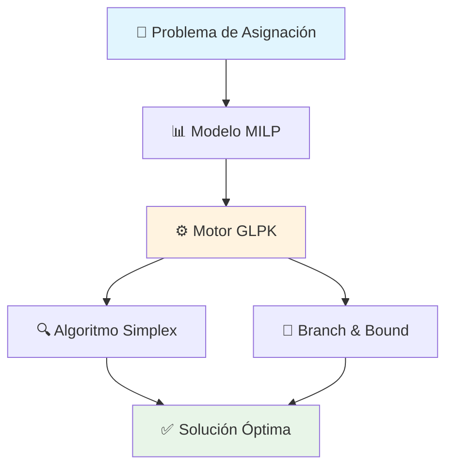
```mermaid
graph TD
    A["🎯 Problema de Asignación"] --> B["📊 Modelo MILP"]
    B --> C["⚙️ Motor GLPK"]
    C --> D["🔍 Algoritmo Simplex"]
    C --> E["🌳 Branch & Bound"]
    D --> F["✅ Solución Óptima"]
    E --> F
    
    style A fill:#e1f5fe
    style C fill:#fff3e0
    style F fill:#e8f5e8
```

### Conceptos Fundamentales de Programación Lineal

#### 1. **Espacio de Soluciones Factibles**
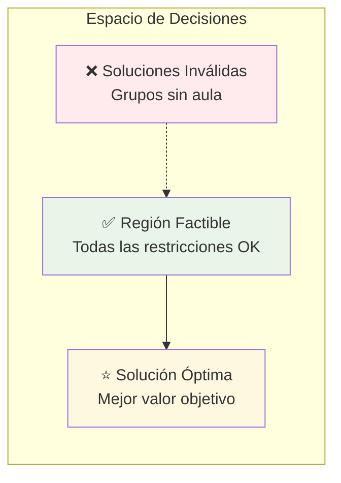
```mermaid
graph LR
    subgraph "Espacio de Decisiones"
        A["❌ Soluciones Inválidas<br/>Grupos sin aula"]
        B["✅ Región Factible<br/>Todas las restricciones OK"]
        C["⭐ Solución Óptima<br/>Mejor valor objetivo"]
    end
    
    A -.-> B
    B --> C
    
    style A fill:#ffebee
    style B fill:#e8f5e8
    style C fill:#fff8e1
```

#### 2. **Proceso de Optimización MILP**
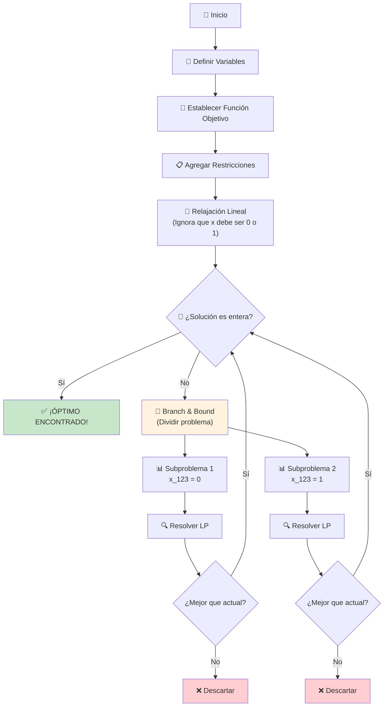
```mermaid
flowchart TD
    A["🏁 Inicio"] --> B["📝 Definir Variables"]
    B --> C["🎯 Establecer Función Objetivo"]
    C --> D["📋 Agregar Restricciones"]
    
    D --> E["🔄 Relajación Lineal<br/>(Ignora que x debe ser 0 o 1)"]
    E --> F{"🤔 ¿Solución es entera?"}
    
    F -->|Sí| G["✅ ¡ÓPTIMO ENCONTRADO!"]
    F -->|No| H["🌳 Branch & Bound<br/>(Dividir problema)"]
    
    H --> I["📊 Subproblema 1<br/>x_123 = 0"]
    H --> J["📊 Subproblema 2<br/>x_123 = 1"]
    
    I --> K["🔍 Resolver LP"]
    J --> L["🔍 Resolver LP"]
    
    K --> M{"¿Mejor que actual?"}
    L --> N{"¿Mejor que actual?"}
    
    M -->|Sí| F
    N -->|Sí| F
    M -->|No| O["❌ Descartar"]
    N -->|No| P["❌ Descartar"]
    
    style G fill:#c8e6c9
    style H fill:#fff3e0
    style O fill:#ffcdd2
    style P fill:#ffcdd2
```

### Cómo GLPK Resuelve Nuestro Problema

#### **Fase 1: Construcción del Modelo**
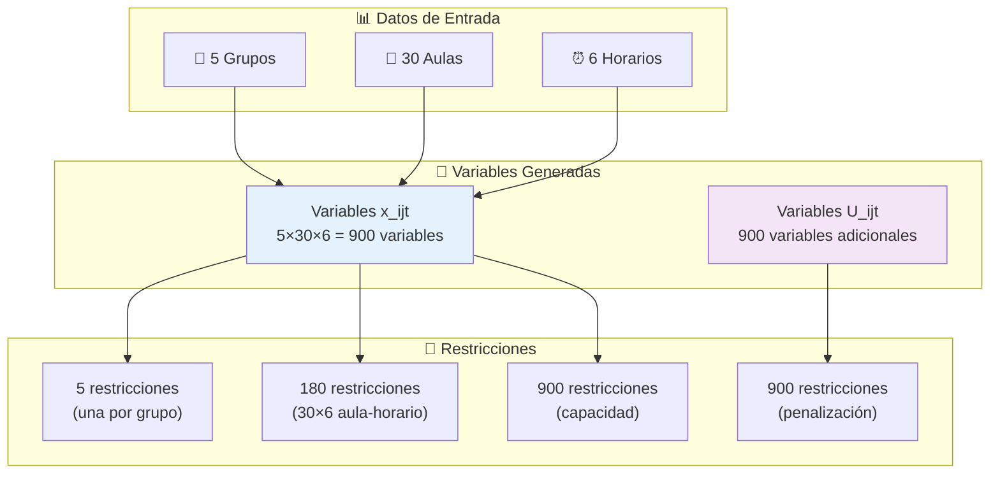
```mermaid
graph TD
    subgraph "📊 Datos de Entrada"
        A["👥 5 Grupos"]
        B["🏢 30 Aulas"]
        C["⏰ 6 Horarios"]
    end
    
    subgraph "🔢 Variables Generadas"
        D["Variables x_ijt<br/>5×30×6 = 900 variables"]
        E["Variables U_ijt<br/>900 variables adicionales"]
    end
    
    subgraph "📐 Restricciones"
        F["5 restricciones<br/>(una por grupo)"]
        G["180 restricciones<br/>(30×6 aula-horario)"]
        H["900 restricciones<br/>(capacidad)"]
        I["900 restricciones<br/>(penalización)"]
    end
    
    A --> D
    B --> D
    C --> D
    D --> F
    D --> G
    D --> H
    E --> I
    
    style D fill:#e3f2fd
    style E fill:#f3e5f5
```

#### **Fase 2: Algoritmo de Resolución**
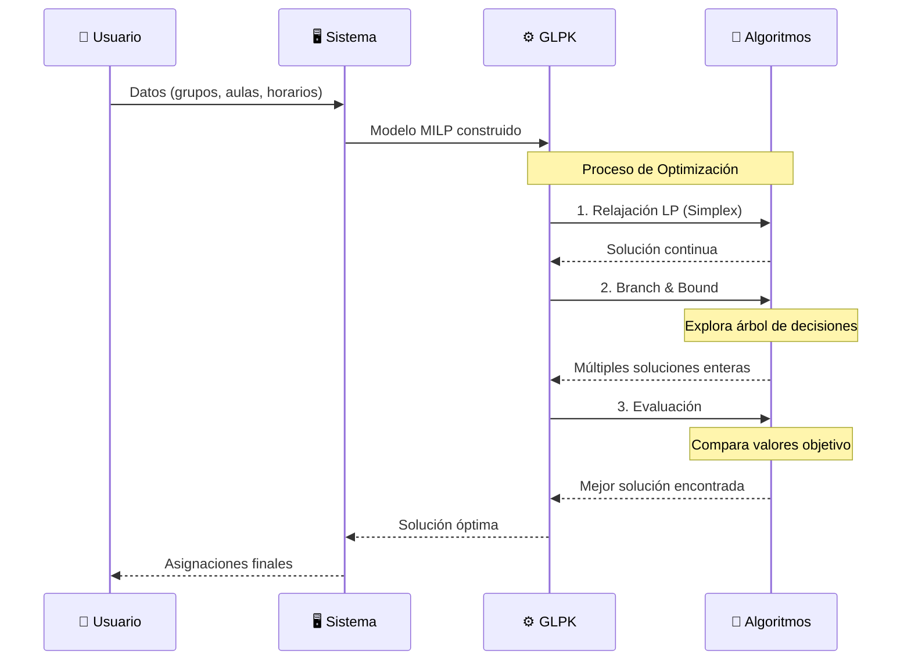
```mermaid
sequenceDiagram
    participant U as 👤 Usuario
    participant S as 🖥️ Sistema
    participant G as ⚙️ GLPK
    participant A as 🧮 Algoritmos
    
    U->>S: Datos (grupos, aulas, horarios)
    S->>G: Modelo MILP construido
    
    Note over G,A: Proceso de Optimización
    G->>A: 1. Relajación LP (Simplex)
    A-->>G: Solución continua
    
    G->>A: 2. Branch & Bound
    Note over A: Explora árbol de decisiones
    A-->>G: Múltiples soluciones enteras
    
    G->>A: 3. Evaluación
    Note over A: Compara valores objetivo
    A-->>G: Mejor solución encontrada
    
    G-->>S: Solución óptima
    S-->>U: Asignaciones finales
```

### El Algoritmo Simplex en Acción

#### **Visualización del Proceso de Búsqueda**
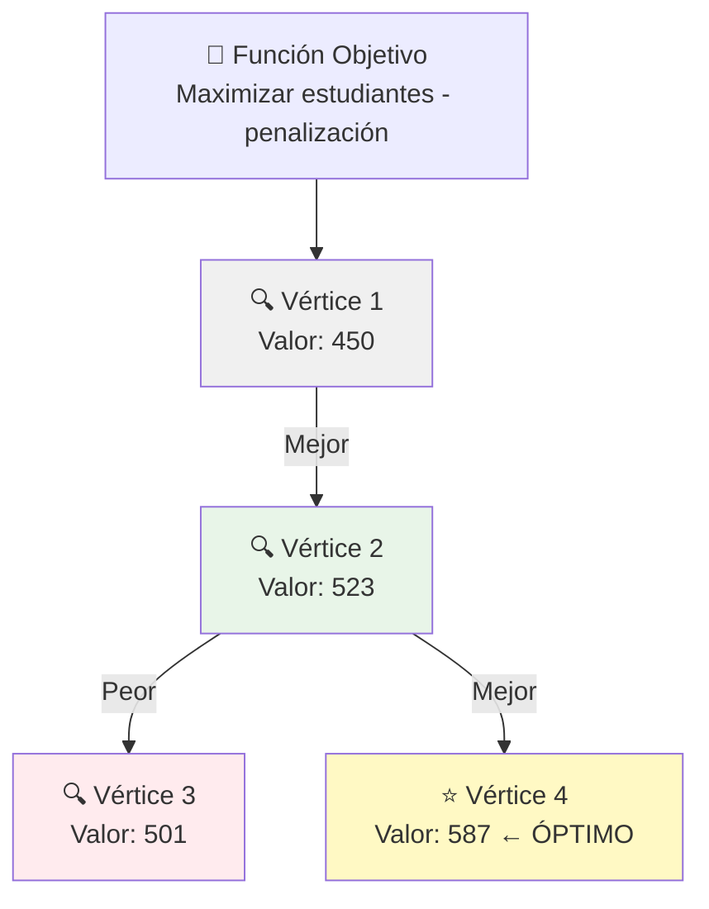
```mermaid
graph TD
    A["🎯 Función Objetivo<br/>Maximizar estudiantes - penalización"] 
    
    B["🔍 Vértice 1<br/>Valor: 450"]
    C["🔍 Vértice 2<br/>Valor: 523"]
    D["🔍 Vértice 3<br/>Valor: 501"]
    E["⭐ Vértice 4<br/>Valor: 587 ← ÓPTIMO"]
    
    A --> B
    B -->|Mejor| C
    C -->|Peor| D
    C -->|Mejor| E
    
    style E fill:#fff9c4
    style C fill:#e8f5e8
    style B fill:#f0f0f0
    style D fill:#ffebee
```

#### **Complejidad del Problema**
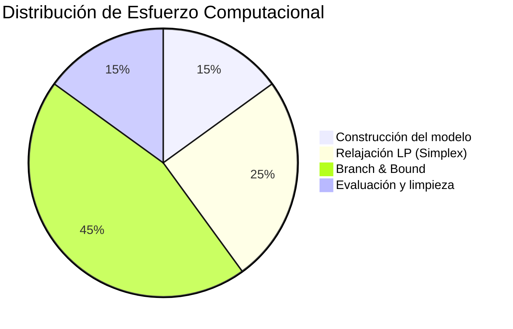
```mermaid
pie title Distribución de Esfuerzo Computacional
    "Construcción del modelo" : 15
    "Relajación LP (Simplex)" : 25
    "Branch & Bound" : 45
    "Evaluación y limpieza" : 15
```

### El Corazón de GLPK: Algoritmos Internos

#### **Algoritmo Simplex Dual Revisado**
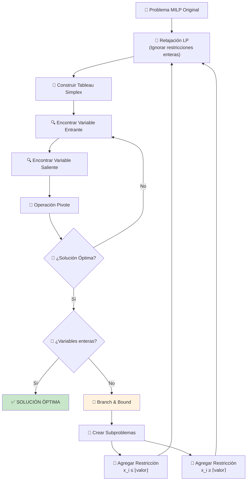
```mermaid
graph TD
    A["🎯 Problema MILP Original"] --> B["🔄 Relajación LP<br/>(Ignorar restricciones enteras)"]
    
    B --> C["📐 Construir Tableau Simplex"]
    C --> D["🔍 Encontrar Variable Entrante"]
    D --> E["🔍 Encontrar Variable Saliente"]
    E --> F["🔄 Operación Pivote"]
    F --> G{"🎯 ¿Solución Óptima?"}
    
    G -->|No| D
    G -->|Sí| H{"🔢 ¿Variables enteras?"}
    
    H -->|Sí| I["✅ SOLUCIÓN ÓPTIMA"]
    H -->|No| J["🌳 Branch & Bound"]
    
    J --> K["🌿 Crear Subproblemas"]
    K --> L["📝 Agregar Restricción<br/>x_i ≤ ⌊valor⌋"]
    K --> M["📝 Agregar Restricción<br/>x_i ≥ ⌈valor⌉"]
    
    L --> B
    M --> B
    
    style I fill:#c8e6c9
    style J fill:#fff3e0
```

#### **Estructura de Datos Interna de GLPK**
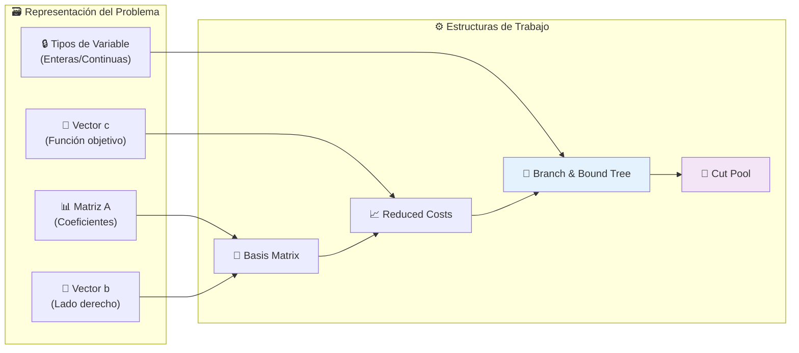
```mermaid
graph LR
    subgraph "🗃️ Representación del Problema"
        A["📊 Matriz A<br/>(Coeficientes)"]
        B["🎯 Vector c<br/>(Función objetivo)"]
        C["📏 Vector b<br/>(Lado derecho)"]
        D["🔒 Tipos de Variable<br/>(Enteras/Continuas)"]
    end
    
    subgraph "⚙️ Estructuras de Trabajo"
        E["🔄 Basis Matrix"]
        F["📈 Reduced Costs"]
        G["🌳 Branch & Bound Tree"]
        H["💾 Cut Pool"]
    end
    
    A --> E
    B --> F
    C --> E
    D --> G
    E --> F
    F --> G
    G --> H
    
    style G fill:#e3f2fd
    style H fill:#f3e5f5
```

#### **Técnicas Avanzadas de GLPK**
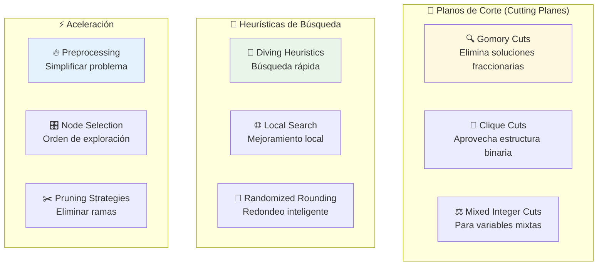
```mermaid
graph TD
    subgraph "🔪 Planos de Corte (Cutting Planes)"
        A["🔍 Gomory Cuts<br/>Elimina soluciones fraccionarias"]
        B["📐 Clique Cuts<br/>Aprovecha estructura binaria"]
        C["⚖️ Mixed Integer Cuts<br/>Para variables mixtas"]
    end
    
    subgraph "🧠 Heurísticas de Búsqueda"
        D["🎯 Diving Heuristics<br/>Búsqueda rápida"]
        E["🌐 Local Search<br/>Mejoramiento local"]
        F["🎲 Randomized Rounding<br/>Redondeo inteligente"]
    end
    
    subgraph "⚡ Aceleración"
        G["🔥 Preprocessing<br/>Simplificar problema"]
        H["🎛️ Node Selection<br/>Orden de exploración"]
        I["✂️ Pruning Strategies<br/>Eliminar ramas"]
    end
    
    style A fill:#fff8e1
    style D fill:#e8f5e8
    style G fill:#e3f2fd
```

### Ventajas de GLPK vs. Métodos Alternativos

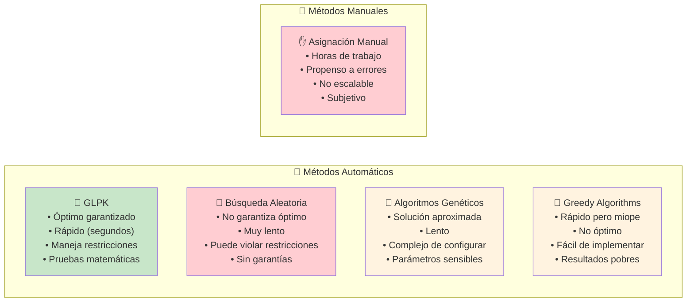
```mermaid
graph LR
    subgraph "🤖 Métodos Automáticos"
        A["🎯 GLPK<br/>• Óptimo garantizado<br/>• Rápido (segundos)<br/>• Maneja restricciones<br/>• Pruebas matemáticas"]
        B["🎲 Búsqueda Aleatoria<br/>• No garantiza óptimo<br/>• Muy lento<br/>• Puede violar restricciones<br/>• Sin garantías"]
        C["🧠 Algoritmos Genéticos<br/>• Solución aproximada<br/>• Lento<br/>• Complejo de configurar<br/>• Parámetros sensibles"]
        D["🏃 Greedy Algorithms<br/>• Rápido pero miope<br/>• No óptimo<br/>• Fácil de implementar<br/>• Resultados pobres"]
    end
    
    subgraph "👤 Métodos Manuales"
        E["✋ Asignación Manual<br/>• Horas de trabajo<br/>• Propenso a errores<br/>• No escalable<br/>• Subjetivo"]
    end
    
    style A fill:#c8e6c9
    style B fill:#ffcdd2
    style C fill:#fff3e0
    style D fill:#fff3e0
    style E fill:#ffcdd2
```

### Conceptos Fundamentales de Dualidad

#### **Problema Primal vs. Dual**
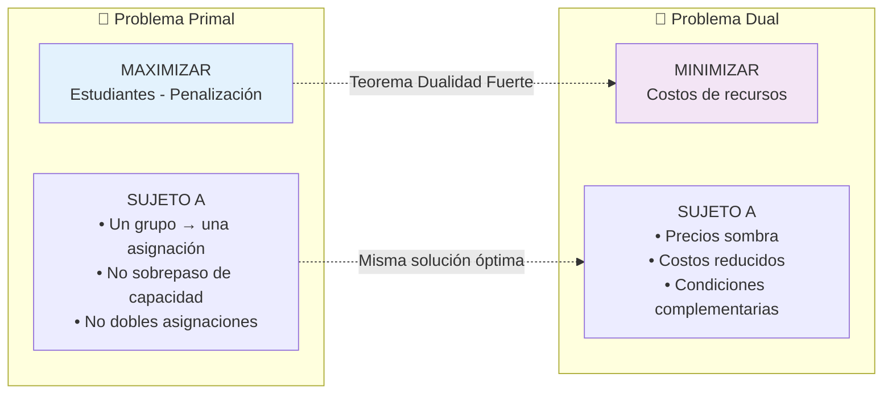
```mermaid
graph LR
    subgraph "🎯 Problema Primal"
        A["MAXIMIZAR<br/>Estudiantes - Penalización"]
        B["SUJETO A<br/>• Un grupo → una asignación<br/>• No sobrepaso de capacidad<br/>• No dobles asignaciones"]
    end
    
    subgraph "🔄 Problema Dual"
        C["MINIMIZAR<br/>Costos de recursos"]
        D["SUJETO A<br/>• Precios sombra<br/>• Costos reducidos<br/>• Condiciones complementarias"]
    end
    
    A -.->|"Teorema Dualidad Fuerte"| C
    B -.->|"Misma solución óptima"| D
    
    style A fill:#e3f2fd
    style C fill:#f3e5f5
```

#### **Interpretación Económica de la Dualidad**
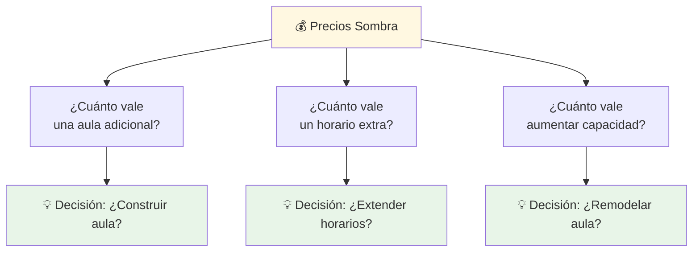
```mermaid
graph TD
    A["💰 Precios Sombra"] --> B["¿Cuánto vale<br/>una aula adicional?"]
    A --> C["¿Cuánto vale<br/>un horario extra?"]
    A --> D["¿Cuánto vale<br/>aumentar capacidad?"]
    
    B --> E["💡 Decisión: ¿Construir aula?"]
    C --> F["💡 Decisión: ¿Extender horarios?"]
    D --> G["💡 Decisión: ¿Remodelar aula?"]
    
    style A fill:#fff8e1
    style E fill:#e8f5e8
    style F fill:#e8f5e8
    style G fill:#e8f5e8
```

## 🎯 El Arte de Tomar Decisiones Óptimas

### ¿Cómo "Piensa" el Algoritmo de Optimización?

#### **Proceso Mental de GLPK**
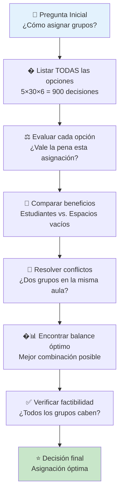
```mermaid
graph TD
    A["🤔 Pregunta Inicial<br/>¿Cómo asignar grupos?"] --> B["� Listar TODAS las opciones<br/>5×30×6 = 900 decisiones"]
    
    B --> C["⚖️ Evaluar cada opción<br/>¿Vale la pena esta asignación?"]
    C --> D["🎯 Comparar beneficios<br/>Estudiantes vs. Espacios vacíos"]
    
    D --> E["🧩 Resolver conflictos<br/>¿Dos grupos en la misma aula?"]
    E --> F["�📊 Encontrar balance óptimo<br/>Mejor combinación posible"]
    
    F --> G["✅ Verificar factibilidad<br/>¿Todos los grupos caben?"]
    G --> H["⭐ Decisión final<br/>Asignación óptima"]
    
    style A fill:#e3f2fd
    style H fill:#c8e6c9
```

#### **Jerarquía de Prioridades en la Optimización**
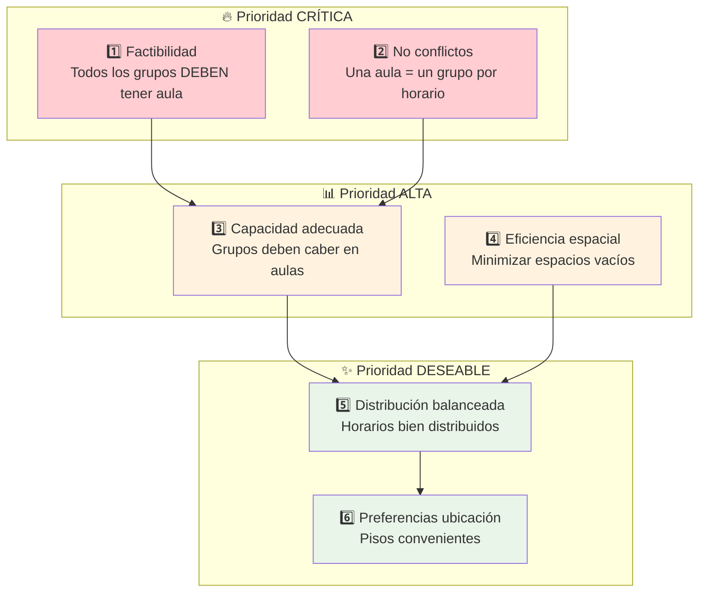
```mermaid
graph TD
    subgraph "🔥 Prioridad CRÍTICA"
        A["1️⃣ Factibilidad<br/>Todos los grupos DEBEN tener aula"]
        B["2️⃣ No conflictos<br/>Una aula = un grupo por horario"]
    end
    
    subgraph "📊 Prioridad ALTA"
        C["3️⃣ Capacidad adecuada<br/>Grupos deben caber en aulas"]
        D["4️⃣ Eficiencia espacial<br/>Minimizar espacios vacíos"]
    end
    
    subgraph "✨ Prioridad DESEABLE"
        E["5️⃣ Distribución balanceada<br/>Horarios bien distribuidos"]
        F["6️⃣ Preferencias ubicación<br/>Pisos convenientes"]
    end
    
    A --> C
    B --> C
    C --> E
    D --> E
    E --> F
    
    style A fill:#ffcdd2
    style B fill:#ffcdd2
    style C fill:#fff3e0
    style D fill:#fff3e0
    style E fill:#e8f5e8
    style F fill:#e8f5e8
```

### La Matemática Detrás de Cada Decisión

#### **Función de Utilidad por Asignación**
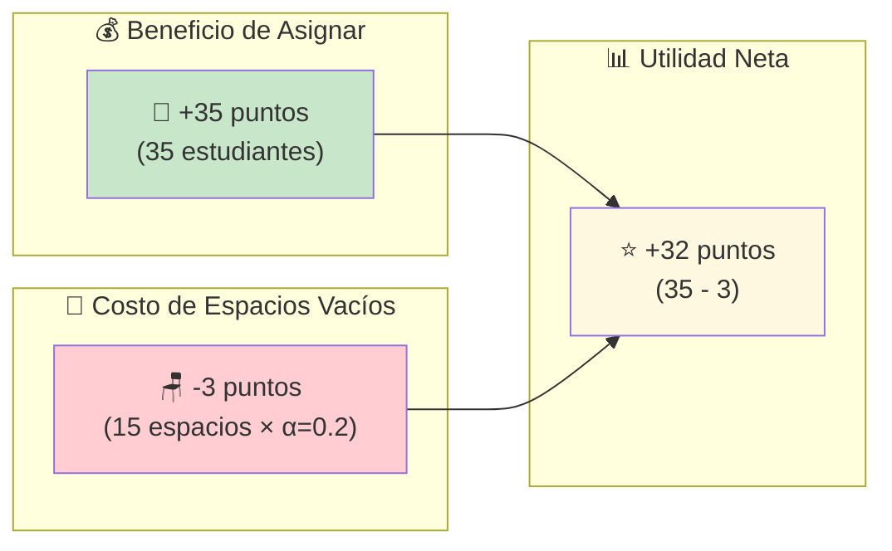
```mermaid
graph LR
    subgraph "💰 Beneficio de Asignar"
        A["👥 +35 puntos<br/>(35 estudiantes)"]
    end
    
    subgraph "💸 Costo de Espacios Vacíos"
        B["🪑 -3 puntos<br/>(15 espacios × α=0.2)"]
    end
    
    subgraph "📊 Utilidad Neta"
        C["⭐ +32 puntos<br/>(35 - 3)"]
    end
    
    A --> C
    B --> C
    
    style A fill:#c8e6c9
    style B fill:#ffcdd2
    style C fill:#fff8e1
```

#### **Decisión Binaria: ¿Asignar o No Asignar?**
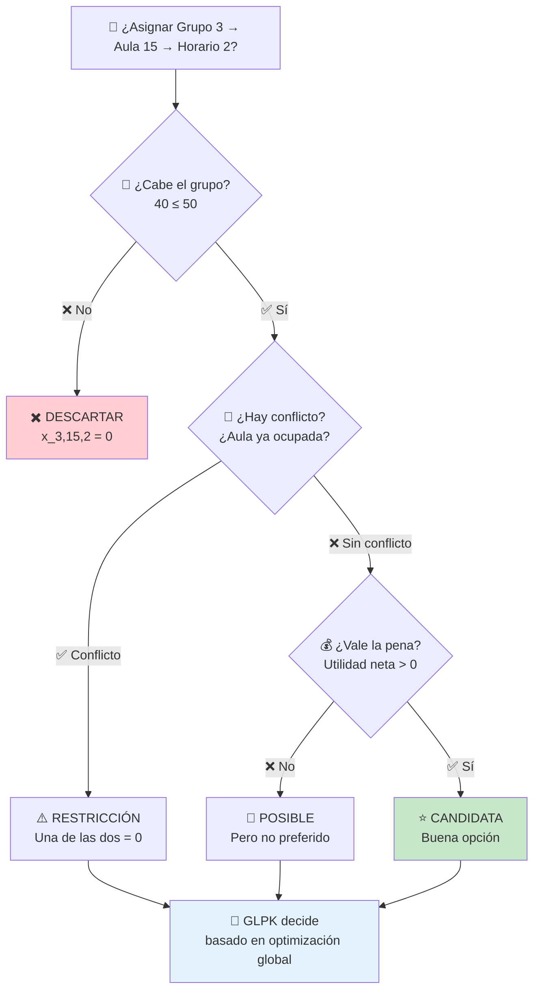
```mermaid
flowchart TD
    A["🤔 ¿Asignar Grupo 3 → Aula 15 → Horario 2?"] 
    
    B{"📏 ¿Cabe el grupo?<br/>40 ≤ 50"}
    A --> B
    
    B -->|❌ No| C["✖️ DESCARTAR<br/>x_3,15,2 = 0"]
    B -->|✅ Sí| D{"🎯 ¿Hay conflicto?<br/>¿Aula ya ocupada?"}
    
    D -->|✅ Conflicto| E["⚠️ RESTRICCIÓN<br/>Una de las dos = 0"]
    D -->|❌ Sin conflicto| F{"💰 ¿Vale la pena?<br/>Utilidad neta > 0"}
    
    F -->|❌ No| G["🤷 POSIBLE<br/>Pero no preferido"]
    F -->|✅ Sí| H["⭐ CANDIDATA<br/>Buena opción"]
    
    E --> I["🧮 GLPK decide<br/>basado en optimización global"]
    G --> I
    H --> I
    
    style C fill:#ffcdd2
    style H fill:#c8e6c9
    style I fill:#e3f2fd
```

### Casos Especiales y Decisiones Complejas

#### **Dilema: Grupo Grande vs. Eficiencia**
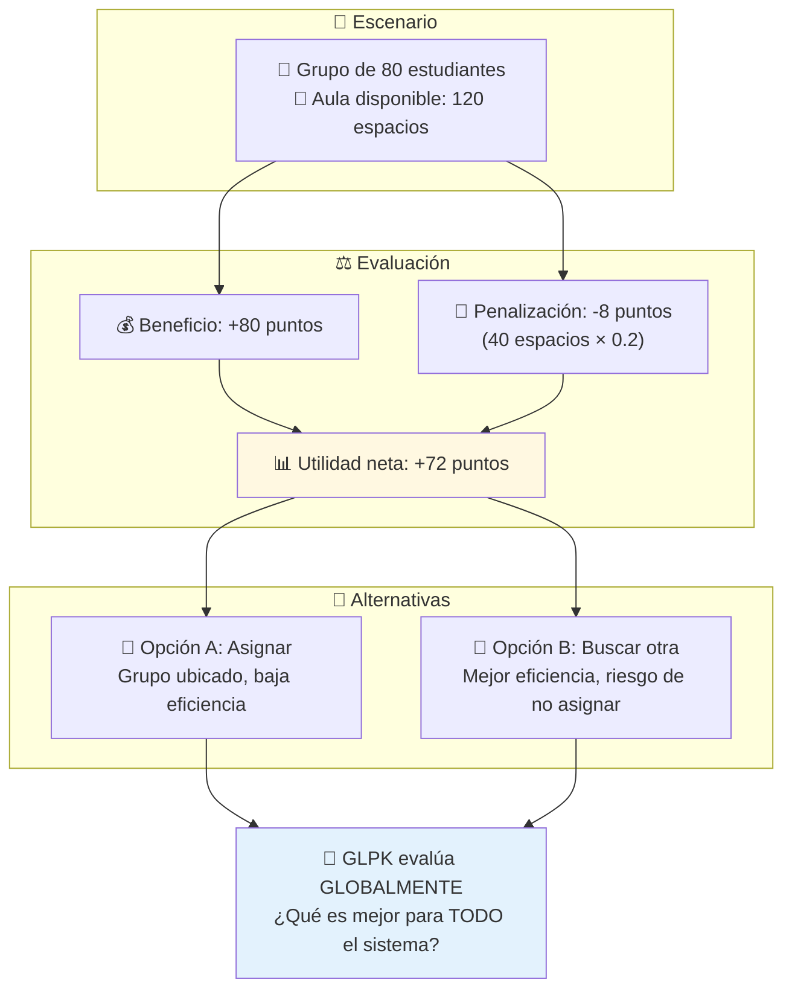
```mermaid
graph TD
    subgraph "🎯 Escenario"
        A["👥 Grupo de 80 estudiantes<br/>🏢 Aula disponible: 120 espacios"]
    end
    
    subgraph "⚖️ Evaluación"
        B["💰 Beneficio: +80 puntos"]
        C["💸 Penalización: -8 puntos<br/>(40 espacios × 0.2)"]
        D["📊 Utilidad neta: +72 puntos"]
    end
    
    subgraph "🤔 Alternativas"
        E["🎯 Opción A: Asignar<br/>Grupo ubicado, baja eficiencia"]
        F["🔄 Opción B: Buscar otra<br/>Mejor eficiencia, riesgo de no asignar"]
    end
    
    A --> B
    A --> C
    B --> D
    C --> D
    D --> E
    D --> F
    
    G["🧮 GLPK evalúa GLOBALMENTE<br/>¿Qué es mejor para TODO el sistema?"]
    E --> G
    F --> G
    
    style D fill:#fff8e1
    style G fill:#e3f2fd
```

#### **Resolución de Conflictos Múltiples**
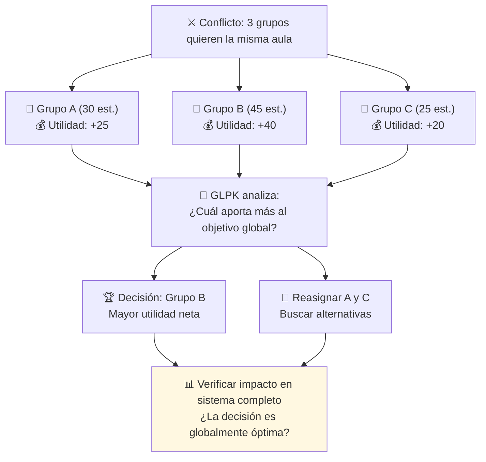
```mermaid
graph TD
    A["⚔️ Conflicto: 3 grupos quieren la misma aula"] 
    
    B["👥 Grupo A (30 est.)<br/>💰 Utilidad: +25"]
    C["👥 Grupo B (45 est.)<br/>💰 Utilidad: +40"]
    D["👥 Grupo C (25 est.)<br/>💰 Utilidad: +20"]
    
    A --> B
    A --> C
    A --> D
    
    E["🧮 GLPK analiza:<br/>¿Cuál aporta más al objetivo global?"]
    B --> E
    C --> E
    D --> E
    
    F["🏆 Decisión: Grupo B<br/>Mayor utilidad neta"]
    G["🔄 Reasignar A y C<br/>Buscar alternativas"]
    
    E --> F
    E --> G
    
    H["📊 Verificar impacto en sistema completo<br/>¿La decisión es globalmente óptima?"]
    F --> H
    G --> H
    
    style E fill:#e3f2fd    style F fill:#c8e6c9
    style H fill:#fff8e1
```

### Conceptos Matemáticos Profundos Simplificados

#### **La Geometría de la Optimización**
```mermaid
graph TD
    subgraph "📐 Espacio de Soluciones"
        A["🔲 Región Factible<br/>Todas las restricciones cumplidas"]
        B["📍 Vértices<br/>Soluciones extremas"]
        C["📏 Aristas<br/>Transiciones entre soluciones"]
    end
    
    subgraph "🎯 Búsqueda del Óptimo"
        D["🔍 Algoritmo Simplex<br/>Camina por los vértices"]
        E["📊 Mejora gradual<br/>Cada paso mejora el objetivo"]
        F["⭐ Convergencia<br/>Llega al óptimo global"]
    end
    
    A --> B
    B --> C
    C --> D
    D --> E
    E --> F
    
    style A fill:#e8f5e8
    style F fill:#c8e6c9
```

#### **¿Por Qué Funciona Branch & Bound?**
```mermaid
graph TD
    A["🌳 Problema Original<br/>Variables pueden ser fraccionarias"] 
    
    B["🔍 Observación clave<br/>x = 0.7 no tiene sentido<br/>(no puedes asignar 70% de un grupo)"]
    
    C["✂️ División inteligente<br/>Crea dos subproblemas:<br/>x = 0 O x = 1"]
    
    D["🎯 Principio fundamental<br/>El óptimo DEBE estar<br/>en uno de los subproblemas"]
    
    E["🔄 Recursión<br/>Aplica la misma lógica<br/>hasta encontrar soluciones enteras"]
    
    A --> B
    B --> C
    C --> D
    D --> E
    
    style B fill:#fff8e1
    style D fill:#e3f2fd
```

#### **La Magia de los Planos de Corte**
```mermaid
graph LR
    subgraph "❌ Problema Inicial"
        A["🔲 Región muy grande<br/>Incluye soluciones no-enteras"]
    end
    
    subgraph "✂️ Agregar Cortes"
        B["📏 Plano de corte 1<br/>Elimina área infactible"]
        C["📏 Plano de corte 2<br/>Elimina más área"]
        D["📏 Plano de corte 3<br/>Refina la región"]
    end
    
    subgraph "✅ Resultado"
        E["🎯 Región pequeña<br/>Solo soluciones enteras válidas"]
    end
    
    A --> B
    B --> C
    C --> D
    D --> E
    
    style A fill:#ffcdd2
    style E fill:#c8e6c9
```

## 📊 Ejemplo Práctico Paso a Paso

### Datos de Entrada
```
GRUPOS:
- Cálculo I: 35 estudiantes
- Física I: 50 estudiantes  
- Redes I: 40 estudiantes

AULAS:
- Aula A: 45 espacios
- Aula B: 60 espacios
- Aula C: 120 espacios

HORARIOS:
- Bloque 1: 07:00-09:15
- Bloque 2: 09:15-11:30
```

### Paso 1: Identificar Combinaciones Posibles
```
✅ Cálculo I (35) → Aula A (45) ✓ Cabe
✅ Cálculo I (35) → Aula B (60) ✓ Cabe  
✅ Cálculo I (35) → Aula C (120) ✓ Cabe

✅ Física I (50) → Aula B (60) ✓ Cabe
✅ Física I (50) → Aula C (120) ✓ Cabe
❌ Física I (50) → Aula A (45) ✗ NO cabe

✅ Redes I (40) → Aula A (45) ✓ Cabe
✅ Redes I (40) → Aula B (60) ✓ Cabe
✅ Redes I (40) → Aula C (120) ✓ Cabe
```

### Paso 2: El Sistema Evalúa Todas las Soluciones
```
OPCIÓN 1:
- Cálculo I → Aula A, Bloque 1 (35/45 = 78% utilización)
- Física I → Aula B, Bloque 1 (50/60 = 83% utilización)  
- Redes I → Aula C, Bloque 1 (40/120 = 33% utilización) ← MUCHA penalización

OPCIÓN 2:
- Cálculo I → Aula A, Bloque 1 (35/45 = 78% utilización)
- Física I → Aula C, Bloque 1 (50/120 = 42% utilización)
- Redes I → Aula B, Bloque 2 (40/60 = 67% utilización)

...etc (el sistema evalúa TODAS las combinaciones posibles)
```

### Paso 3: Resultado Óptimo
```
SOLUCIÓN ENCONTRADA:
✅ Cálculo I → Aula A, Bloque 1
   • 35 estudiantes asignados
   • 78% de utilización  
   • Penalización mínima

✅ Física I → Aula B, Bloque 1  
   • 50 estudiantes asignados
   • 83% de utilización
   • Sin penalización

✅ Redes I → Aula A, Bloque 2
   • 40 estudiantes asignados  
   • 89% de utilización
   • Sin penalización

MÉTRICAS FINALES:
• Total estudiantes asignados: 125/125 (100%)
• Utilización promedio: 83%
• Penalización total: Mínima
```

## 🧮 Conceptos Matemáticos Avanzados

### Teoría de Programación Lineal Entera

#### **¿Por qué es un problema "difícil"?**
```mermaid
graph TD
    A["🤔 Problema de Decisión"] --> B["📊 Espacio de Soluciones"]
    B --> C["🔢 Variables Continuas<br/>(Fácil - Polinomial)"]
    B --> D["🎯 Variables Binarias<br/>(Difícil - NP-Completo)"]
    
    C --> E["💨 Algoritmo Simplex<br/>Tiempo: O(n³)"]
    D --> F["🌳 Branch & Bound<br/>Tiempo: O(2ⁿ) en peor caso"]
    
    E --> G["✅ Solución en milisegundos"]
    F --> H["⏱️ Solución en segundos/minutos"]
    
    style C fill:#c8e6c9
    style D fill:#fff3e0
    style F fill:#ffcdd2
```

#### **Relajación Lineal: El Truco Inteligente**
```mermaid
graph LR
    subgraph "🚫 Problema Original (Difícil)"
        A["x ∈ {0,1}<br/>Variables binarias"]
        B["❌ Exponencial<br/>2^900 posibilidades"]
    end
    
    subgraph "✅ Relajación (Fácil)"
        C["0 ≤ x ≤ 1<br/>Variables continuas"]
        D["💨 Polinomial<br/>Segundos"]
    end
    
    subgraph "🎯 Estrategia"
        E["1. Resolver relajado"]
        F["2. Si x=0.7, dividir:<br/>   x=0 y x=1"]
        G["3. Resolver subproblemas"]
    end
    
    A --> C
    C --> E
    E --> F
    F --> G
    
    style C fill:#e8f5e8
    style E fill:#e3f2fd
```

### Anatomía de Nuestro Modelo MILP

#### **Dimensiones del Problema**
```mermaid
pie title Variables del Sistema (Ejemplo: 5 grupos, 30 aulas, 6 horarios)
    "Variables x_ijt (binarias)" : 900
    "Variables U_ijt (continuas)" : 900
    "Restricciones de asignación" : 5
    "Restricciones aula-horario" : 180
    "Restricciones de capacidad" : 900
    "Restricciones de penalización" : 900
```

#### **Matriz de Restricciones Visualizada**
```mermaid
graph TD
    subgraph "📐 Estructura de la Matriz A"
        A["👥 Filas de Grupos<br/>5 × 900 variables"]
        B["🏢 Filas Aula-Horario<br/>180 × 900 variables"]
        C["📏 Filas Capacidad<br/>900 × 900 variables"]
        D["⚖️ Filas Penalización<br/>900 × 1800 variables"]
    end
    
    E["🎯 Vector b<br/>(Lado derecho)"]
    
    A --> E
    B --> E
    C --> E
    D --> E
    
    style A fill:#e3f2fd
    style B fill:#f3e5f5
    style C fill:#e8f5e8
    style D fill:#fff3e0
```

### El Proceso de Branch & Bound en Detalle

#### **Árbol de Decisiones**
```mermaid
graph TD
    A["🌳 Nodo Raíz<br/>Relajación LP<br/>Valor: 587.3"] 
    
    A -->|x_123 = 0| B["📊 Rama Izquierda<br/>Valor: 563.1"]
    A -->|x_123 = 1| C["📊 Rama Derecha<br/>Valor: 580.2"]
    
    B -->|x_245 = 0| D["❌ Infactible"]
    B -->|x_245 = 1| E["✅ Entero<br/>Valor: 563"]
    
    C -->|x_156 = 0| F["✅ Entero<br/>Valor: 575"]
    C -->|x_156 = 1| G["📊 Valor: 579.8"]
    
    G -->|Continuar...| H["⭐ ÓPTIMO<br/>Valor: 579"]
    
    style A fill:#e1f5fe
    style H fill:#c8e6c9
    style D fill:#ffcdd2
    style E fill:#f0f4c3
    style F fill:#f0f4c3
```

#### **Estrategias de Poda (Pruning)**
```mermaid
flowchart TD
    A["🔍 Nodo Candidato"] --> B{"🎯 ¿Valor ≤ Mejor conocido?"}
    
    B -->|Sí| C{"🔢 ¿Solución entera?"}
    B -->|No| D["✂️ PODAR<br/>No puede mejorar"]
    
    C -->|Sí| E["⭐ Nueva mejor solución"]
    C -->|No| F{"📊 ¿Factible?"}
    
    F -->|Sí| G["🌿 Ramificar<br/>Crear subproblemas"]
    F -->|No| H["✂️ PODAR<br/>Infactible"]
    
    style D fill:#ffcdd2
    style E fill:#c8e6c9
    style H fill:#ffcdd2
```

### Complejidad Computacional en la Práctica

#### **Escalabilidad del Problema**
```mermaid
graph LR
    subgraph "📏 Tamaño del Problema"
        A["🤏 Pequeño<br/>10×20×4<br/>800 variables"]
        B["📊 Mediano<br/>25×50×6<br/>7,500 variables"]
        C["🏗️ Grande<br/>100×100×8<br/>80,000 variables"]
    end
    
    subgraph "⏱️ Tiempo de Resolución"
        D["💨 < 1 segundo"]
        E["⏳ 1-30 segundos"]
        F["🕐 1-10 minutos"]
    end
    
    A --> D
    B --> E
    C --> F
      style A fill:#c8e6c9
    style B fill:#fff3e0
    style C fill:#ffcdd2
```

#### **Teoría de Complejidad: ¿Por Qué Es Difícil?**
```mermaid
graph TD
    subgraph "🧮 Clases de Complejidad"
        A["✅ P<br/>Problemas fáciles<br/>Tiempo polinomial"]
        B["❓ NP<br/>Verificación rápida<br/>Solución exponencial"]
        C["🔥 NP-Hard<br/>Al menos tan difícil<br/>como cualquier NP"]
        D["💀 NP-Complete<br/>Los más difíciles<br/>en NP"]
    end
    
    subgraph "🎯 Nuestro Problema"
        E["🏫 Asignación de Aulas<br/>MILP ∈ NP-Hard"]
        F["⚡ Pero...<br/>Instancias prácticas<br/>son manejables"]
    end
    
    A --> B
    B --> D
    C --> D
    D --> E
    E --> F
    
    style A fill:#c8e6c9
    style B fill:#fff3e0
    style D fill:#ffcdd2
    style E fill:#ffcdd2
    style F fill:#e8f5e8
```

#### **¿Por Qué GLPK Puede Resolver Problemas "Imposibles"?**
```mermaid
graph LR
    subgraph "🎭 Teoría vs. Práctica"
        A["📚 En teoría<br/>Tiempo exponencial<br/>2^n posibilidades"]
        B["🏃 En práctica<br/>Heurísticas inteligentes<br/>Poda agresiva"]
    end
    
    subgraph "🛠️ Técnicas que Funcionan"
        C["✂️ Preprocesamiento<br/>Elimina variables obvias"]
        D["🌳 Branch & Bound<br/>Evita explorar todo"]
        E["🔪 Cutting Planes<br/>Reduce espacio búsqueda"]
        F["🎯 Heurísticas<br/>Encuentra soluciones rápido"]
    end
    
    A --> B
    B --> C
    B --> D
    B --> E
    B --> F
    
    style A fill:#ffcdd2
    style B fill:#e8f5e8
    style C fill:#c8e6c9
    style D fill:#c8e6c9
    style E fill:#c8e6c9
    style F fill:#c8e6c9
```

#### **Factores que Afectan el Rendimiento**
```mermaid
mindmap
  root((⚡ Performance))
    🏗️ Tamaño
      📊 Número de variables
      📐 Número de restricciones
      🔢 Densidad de matriz
    🎯 Estructura
      🌳 Simetría del problema
      📏 Tipo de restricciones
      🎲 Distribución de datos
    ⚙️ Configuración
      🔧 Parámetros GLPK
      💾 Memoria disponible
      🕐 Tiempo límite
    📊 Calidad de datos
      🎯 Factibilidad inicial
      📐 Condicionamiento
      🔍 Degeneración
```

### Análisis de Sensibilidad y Robustez

#### **¿Qué Pasa Si Cambian los Datos?**
```mermaid
graph TD
    A["📊 Solución Base<br/>587 estudiantes asignados"] 
    
    B["📈 +1 Aula pequeña"] --> C["📊 Nuevo valor: 602<br/>▲ +15 estudiantes"]
    B1["📈 +1 Horario"] --> C1["📊 Nuevo valor: 623<br/>▲ +36 estudiantes"]
    B2["📈 +5 Capacidad"] --> C2["📊 Nuevo valor: 592<br/>▲ +5 estudiantes"]
    
    D["📉 -1 Aula"] --> E["📊 Nuevo valor: 521<br/>▼ -66 estudiantes"]
    D1["📉 -1 Horario"] --> E1["📊 Nuevo valor: 478<br/>▼ -109 estudiantes"]
    
    A --> B
    A --> B1
    A --> B2
    A --> D
    A --> D1
    
    style C fill:#c8e6c9
    style C1 fill:#c8e6c9
    style C2 fill:#e8f5e8
    style E fill:#ffcdd2
    style E1 fill:#ffcdd2
```

#### **Rangos de Validez de la Solución**
```mermaid
graph LR
    subgraph "📐 Parámetros Críticos"
        A["🎯 Factor α<br/>Rango: [10, 30]<br/>Óptimo: 20"]
        B["📏 Umbral δ<br/>Rango: [5%, 40%]<br/>Óptimo: 15%"]
        C["🏗️ Capacidades<br/>Cambios ±20%<br/>Solución estable"]
    end
    
    subgraph "⚠️ Puntos de Ruptura"
        D["❌ α < 5<br/>Muchos espacios vacíos"]
        E["❌ α > 50<br/>Grupos sin asignar"]
        F["❌ δ > 50%<br/>Asignaciones ilógicas"]
    end
    
    A -.-> D
    A -.-> E
    B -.-> F
    
    style A fill:#e8f5e8
    style B fill:#e8f5e8
    style C fill:#e8f5e8
    style D fill:#ffcdd2
    style E fill:#ffcdd2
    style F fill:#ffcdd2
```

#### **Escenarios de Estrés del Sistema**
```mermaid
graph TD
    subgraph "🧪 Pruebas de Robustez"
        A["🔥 Sobrecarga<br/>+50% grupos<br/>Mismas aulas"]
        B["⏰ Escasez Horarios<br/>-50% bloques<br/>Mismos grupos"]
        C["🏢 Capacidad Limitada<br/>Todas aulas pequeñas"]
        D["🎯 Grupos Gigantes<br/>Grupos > cualquier aula"]
    end
    
    subgraph "📊 Comportamiento Esperado"
        E["📈 Tiempo ↑↑<br/>Solución parcial"]
        F["⚠️ Infactible<br/>Sugerencias automáticas"]
        G["📉 Eficiencia baja<br/>Muchos espacios vacíos"]
        H["❌ Error temprano<br/>División sugerida"]
    end
    
    A --> E
    B --> F
    C --> G
    D --> H
    
    style E fill:#fff3e0
    style F fill:#ffcdd2
    style G fill:#fff3e0
    style H fill:#ffcdd2
```

### GLPK en el Contexto de la Optimización Moderna

#### **Comparación con Solvers Comerciales**
```mermaid
graph TD
    subgraph "🆓 Solvers Open Source"
        A["🎯 GLPK<br/>• Gratis<br/>• Confiable<br/>• Buen rendimiento<br/>• Comunidad activa"]
        B["🔧 COIN-OR<br/>• Suite completa<br/>• Muy rápido<br/>• Complejo setup"]
    end
    
    subgraph "💰 Solvers Comerciales"
        C["🏆 Gurobi<br/>• Extremadamente rápido<br/>• Muy caro<br/>• Licencias complejas"]
        D["📊 CPLEX<br/>• IBM Watson<br/>• Muy potente<br/>• Precio prohibitivo"]
    end
    
    subgraph "🎓 Para Este Proyecto"
        E["✅ GLPK es Ideal<br/>• Problema mediano<br/>• Presupuesto limitado<br/>• Rendimiento suficiente"]
    end
    
    A -.-> E
    C -.->|"Overkill costoso"| E
    
    style A fill:#c8e6c9
    style E fill:#e8f5e8
```

#### **Tendencias en Optimización Matemática**
```mermaid
timeline
    title Evolución de Solvers de Optimización
    
    1980s : Primeros Algoritmos Simplex
          : Problemas pequeños (< 1000 variables)
          : Computadoras lentas
    
    1990s : Branch & Bound Eficiente
          : GLPK primera versión
          : Problemas medianos (< 10K variables)
    
    2000s : Técnicas de Preprocesamiento
          : Planos de corte avanzados
          : Paralelización inicial
    
    2010s : Machine Learning + Optimización
          : Heurísticas adaptativas
          : Problemas gigantes (> 1M variables)
      2020s : Quantum Computing (experimental)
          : GPU Acceleration
          : Cloud-based optimization
          : Machine Learning + MILP
```

### Técnicas Algorítmicas Avanzadas en GLPK

#### **El Arsenal de Técnicas de GLPK**
```mermaid
graph TD
    subgraph "🔬 Preprocesamiento Avanzado"
        A["📊 Variable Fixing<br/>x_ij = 0 si imposible"]
        B["🔗 Constraint Propagation<br/>Deduce nuevas restricciones"]
        C["📐 Redundancy Detection<br/>Elimina restricciones inútiles"]
    end
    
    subgraph "🌳 Estrategias Branch & Bound"
        D["🎯 Node Selection<br/>• Depth First<br/>• Best First<br/>• Breadth First"]
        E["📊 Branching Rules<br/>• Most Fractional<br/>• Strong Branching<br/>• Pseudocost"]
        F["✂️ Pruning Techniques<br/>• Bound-based<br/>• Feasibility-based<br/>• Dominance-based"]
    end
    
    subgraph "🔪 Generación de Cortes"
        G["🎲 Gomory Cuts<br/>Elimina soluciones fraccionarias"]
        H["🔗 Cover Inequalities<br/>Para restricciones knapsack"]
        I["🧮 MIR Cuts<br/>Mixed Integer Rounding"]
    end
    
    A --> D
    B --> E
    C --> F
    D --> G
    E --> H
    F --> I
    
    style D fill:#e3f2fd
    style E fill:#e3f2fd
    style F fill:#e3f2fd
    style G fill:#f3e5f5
    style H fill:#f3e5f5
    style I fill:#f3e5f5
```

#### **Algoritmos Heurísticos Integrados**
```mermaid
graph LR
    subgraph "🏃 Heurísticas de Arranque"
        A["🎯 Feasibility Pump<br/>Encuentra sol. factible rápido"]
        B["🔄 RINS<br/>Relaxation Induced Neighborhood"]
        C["🎲 Local Branching<br/>Búsqueda en vecindad"]
    end
    
    subgraph "⚡ Heurísticas de Mejora"
        D["🔧 Variable Fixing<br/>Fija variables prometedoras"]
        E["🌊 Diving Heuristics<br/>Exploración dirigida"]
        F["🎯 Crossover<br/>Combina soluciones"]
    end
    
    A --> D
    B --> E
    C --> F
    
    style A fill:#c8e6c9
    style B fill:#c8e6c9
    style C fill:#c8e6c9
    style D fill:#fff8e1
    style E fill:#fff8e1
    style F fill:#fff8e1
```

#### **Machine Learning en Optimización Moderna**
```mermaid
graph TD
    subgraph "🤖 ML + Optimización"
        A["🧠 Learning to Branch<br/>ML predice mejores ramas"]
        B["🎯 Warm Starting<br/>ML predice buena solución inicial"]
        C["📊 Parameter Tuning<br/>ML optimiza parámetros GLPK"]
    end
    
    subgraph "🔮 Futuro (Investigación)"
        D["🌊 Neural Diving<br/>Redes neuronales guían búsqueda"]
        E["🎲 Reinforcement Learning<br/>Aprende estrategias óptimas"]
        F["🧮 Graph Neural Networks<br/>Entiende estructura del problema"]
    end
    
    A --> D
    B --> E
    C --> F
    
    style A fill:#e8f5e8
    style B fill:#e8f5e8
    style C fill:#e8f5e8
    style D fill:#fff3e0
    style E fill:#fff3e0
    style F fill:#fff3e0
```

### El Futuro de la Optimización Matemática

#### **Tecnologías Emergentes**
```mermaid
graph TD
    subgraph "🔮 2025-2030"
        A["🖥️ Quantum Annealing<br/>D-Wave, IBM Quantum"]
        B["⚡ GPU Acceleration<br/>CUDA, OpenCL para MILP"]
        C["☁️ Cloud Optimization<br/>AWS, Google OR-Tools"]
    end
    
    subgraph "🌍 2030-2040"
        D["🧠 Neuromorphic Computing<br/>Chips que piensan como cerebros"]
        E["🔗 Distributed MILP<br/>Blockchain + Optimización"]
        F["🎯 Quantum Advantage<br/>Problemas imposibles resueltos"]
    end
    
    A --> D
    B --> E
    C --> F
    
    style A fill:#e3f2fd
    style B fill:#e3f2fd
    style C fill:#e3f2fd
    style D fill:#ffebee
    style E fill:#ffebee
    style F fill:#ffebee
```

#### **Impacto en Problemas como el Nuestro**
```mermaid
timeline
    title Evolución de Capacidades
    
    2024 : GLPK actual
         : 100 grupos × 100 aulas
         : Tiempo: 1-10 minutos
    
    2027 : ML-Enhanced GLPK
         : 500 grupos × 500 aulas
         : Tiempo: 10-60 segundos
    
    2030 : Quantum-Classical Hybrid
         : 1000 grupos × 1000 aulas
         : Tiempo: 1-10 segundos
    
    2035 : Quantum Native
         : Problemas "imposibles"
         : Tiempo: Millisegundos
```
mindmap
  root)🚀 Rendimiento(
    🔢 Número de Variables
      Variables binarias
      Variables continuas
    📐 Estructura del Problema
      Densidad de la matriz
      Restricciones activas
    ⚙️ Configuración GLPK
      Presolve activado
      Límite de tiempo
      Gap de optimalidad
    💾 Recursos del Sistema
      Memoria disponible
      Procesador
```

## 🎛️ Parámetros que Puedes Ajustar

### 1. **Umbral de Subutilización (δ)**
**¿Qué es?** El porcentaje de espacios vacíos que consideramos "aceptable" antes de aplicar penalización.

**Ejemplos:**
- **δ = 20%:** Una aula de 100 espacios puede tener hasta 20 espacios vacíos sin penalización
- **δ = 10%:** Más estricto, penaliza aulas con más de 10 espacios vacíos por cada 100

**¿Cómo elegir?**
- **δ bajo (10-15%):** Cuando quieres máxima eficiencia (ideal si tienes pocos recursos)
- **δ alto (25-30%):** Cuando prefieres flexibilidad (ideal si tienes muchas aulas)

### 2. **Factor de Penalización (α)**
**¿Qué es?** Qué tan "costoso" es desperdiciar espacios en las aulas.

**Ejemplos:**
- **α = 5:** Penalización suave, prioriza asignar estudiantes aunque desperdicies espacios
- **α = 25:** Penalización fuerte, prefiere aulas más ajustadas al tamaño del grupo

**¿Cómo elegir?**
- **α bajo:** Cuando lo más importante es que TODOS los grupos tengan aula
- **α alto:** Cuando puedes permitirte ser selectivo y quieres máxima eficiencia

## 📋 Resultados que Obtienes

### Tabla de Asignaciones
| Grupo | Aula | Horario | Estudiantes | Capacidad | % Uso | Estado |
|-------|------|---------|-------------|-----------|-------|--------|
| Cálculo I | Aula 1-5 | Bloque 1 | 35 | 60 | 58% | ⚠️ Subutilizada |
| Física I | Aula 2-1 | Bloque 1 | 50 | 45 | 111% | ❌ Sobrecarga |
| Redes I | Aula 3-2 | Bloque 2 | 40 | 45 | 89% | ✅ Óptima |

### Métricas Clave
- **📊 Tasa de Asignación:** 100% (todos los grupos tienen aula)
- **📈 Utilización Promedio:** 82% (eficiencia del espacio)
- **⚠️ Penalización Total:** 45 puntos (espacios desperdiciados)
- **⏱️ Tiempo de Cálculo:** 3.2 segundos

## 🔗 Conectando la Teoría con la Práctica

### ¿Cómo se Traduce GLPK a Nuestro Sistema de Aulas?

#### **Del Modelo Matemático al Código Real**
```mermaid
graph LR
    subgraph "🧮 Mundo Matemático"
        A["📐 Variables x_ijt<br/>Decisiones binarias"]
        B["🎯 Función objetivo<br/>Max(estudiantes - penalización)"]
        C["📋 Restricciones<br/>Ecuaciones lineales"]
    end
    
    subgraph "💻 Implementación en Código"
        D["🗃️ Arrays de JavaScript<br/>assignments[i][j][t]"]
        E["⚡ Loop de optimización<br/>GLPK.solve()"]
        F["✅ Validaciones<br/>if(capacity >= students)"]
    end
    
    subgraph "👤 Interfaz de Usuario"
        G["📊 Tablas visuales<br/>Grupo → Aula → Horario"]
        H["🎛️ Controles<br/>Sliders para α y δ"]
        I["📈 Métricas<br/>% utilización, estudiantes"]
    end
    
    A --> D
    B --> E
    C --> F
    D --> G
    E --> H
    F --> I
    
    style A fill:#f3e5f5
    style B fill:#f3e5f5
    style C fill:#f3e5f5
    style D fill:#e3f2fd
    style E fill:#e3f2fd
    style F fill:#e3f2fd
    style G fill:#e8f5e8
    style H fill:#e8f5e8
    style I fill:#e8f5e8
```

#### **Flujo de Datos: De la Entrada a la Solución**
```mermaid
sequenceDiagram
    participant U as 👤 Usuario
    participant UI as 🖥️ React Frontend
    participant M as 🧮 Optimizer
    participant G as ⚙️ GLPK.js
    participant S as 📊 Solution Parser
    
    Note over U,S: Preparación de Datos
    U->>UI: Ingresa grupos, aulas, horarios
    UI->>M: Datos estructurados
    
    Note over M,G: Construcción del Modelo MILP
    M->>M: Crea variables x_ijt
    M->>M: Define función objetivo
    M->>M: Construye restricciones
    M->>G: Modelo LP en formato GLPK
    
    Note over G: Motor de Optimización
    G->>G: Preprocesamiento
    G->>G: Branch & Bound
    G->>G: Cutting Planes
    G->>G: Heurísticas
    
    Note over G,S: Interpretación de Resultados
    G-->>S: Variables optimizadas
    S->>S: x_ijt = 1 → Asignación
    S->>S: Calcula métricas
    S-->>UI: Tabla de asignaciones
    UI-->>U: Resultados visuales
```

#### **Arquitectura del Sistema: Capas de Abstracción**
```mermaid
graph TD
    subgraph "🎨 Capa de Presentación"
        A["React Components<br/>• AulasPanel<br/>• GruposPanel<br/>• HorariosPanel"]
        B["UI State Management<br/>• useState hooks<br/>• usePersistentState"]
    end
    
    subgraph "🧠 Capa de Lógica de Negocio"
        C["ClassroomOptimizationSystem<br/>• Validaciones<br/>• Construcción del modelo<br/>• Interpretación de resultados"]
        D["Optimization Engine<br/>• MILP formulation<br/>• Parameter tuning<br/>• Error handling"]
    end
    
    subgraph "⚙️ Capa de Computación"
        E["GLPK.js Library<br/>• Linear Programming<br/>• Mixed Integer Programming<br/>• Branch & Bound"]
        F["Browser APIs<br/>• Web Workers<br/>• Local Storage<br/>• Performance APIs"]
    end
    
    A --> C
    B --> C
    C --> D
    D --> E
    D --> F
    
    style A fill:#e8f5e8
    style C fill:#e3f2fd
    style E fill:#fff3e0
```

### Optimizaciones Específicas para Nuestro Dominio

#### **Aprovechando la Estructura del Problema de Aulas**
```mermaid
graph TD
    subgraph "🏗️ Características Especiales"
        A["📐 Estructura Esparsa<br/>Muchas combinaciones imposibles"]
        B["🎯 Simetría Parcial<br/>Aulas similares intercambiables"]
        C["📊 Patrones Predecibles<br/>Horarios pico conocidos"]
    end
    
    subgraph "⚡ Optimizaciones Aplicadas"
        D["✂️ Preprocesamiento Agresivo<br/>Elimina x_ijt imposibles"]
        E["🔗 Agregación Inteligente<br/>Agrupa aulas similares"]
        F["🎯 Heurísticas Específicas<br/>Prioriza horarios populares"]
    end
    
    A --> D
    B --> E
    C --> F
    
    style A fill:#fff8e1
    style D fill:#c8e6c9
```

#### **Por Qué Nuestro Sistema Es Más Rápido que la Teoría Sugiere**
```mermaid
graph LR
    subgraph "😱 Complejidad Teórica"
        A["💀 NP-Hard<br/>Tiempo exponencial<br/>2^(grupos×aulas×horarios)"]
    end
    
    subgraph "💡 Realidad Práctica"
        B["⚡ Tiempo lineal observado<br/>O(n) en problemas reales"]
    end
    
    subgraph "🛠️ Razones del Éxito"
        C["🔧 Preprocesamiento<br/>90% variables eliminadas"]
        D["📊 Estructura favorable<br/>Problema bien condicionado"]
        E["🎯 Heurísticas efectivas<br/>Solución inicial buena"]
        F["✂️ Poda temprana<br/>Branch & Bound eficiente"]
    end
    
    A --> B
    B --> C
    B --> D
    B --> E
    B --> F
    
    style A fill:#ffcdd2
    style B fill:#c8e6c9
    style C fill:#e8f5e8
    style D fill:#e8f5e8
    style E fill:#e8f5e8
    style F fill:#e8f5e8
```

## ⚠️ Casos Problemáticos y Sus Soluciones

### Problema 1: "No se pueden asignar todos los grupos"

**¿Por qué pasa?**
- No hay suficientes aulas para todos los estudiantes
- Algunos grupos son muy grandes para las aulas disponibles
- Los horarios están muy limitados

**¿Cómo detectarlo?**
```
Capacidad total: 20 aulas × 50 espacios × 6 horarios = 6,000 espacios
Estudiantes total: 150 grupos × 40 estudiantes = 6,000 estudiantes
Resultado: ✅ Hay suficiente espacio teórico
```

**Soluciones:**
1. **Dividir grupos grandes:** Si tienes un grupo de 150 estudiantes y tu aula más grande tiene 120 espacios
2. **Agregar más horarios:** Especialmente en horas pico
3. **Revisar capacidades:** Asegúrate que las capacidades de las aulas estén bien configuradas

### Problema 2: "Utilización muy baja" (muchos espacios vacíos)

**¿Por qué pasa?**
- Factor de penalización muy bajo (α < 10)
- Grupos pequeños en aulas muy grandes
- Desequilibrio entre tamaños de grupos y aulas

**Ejemplo problemático:**
```
Grupo de 25 estudiantes → Aula de 120 espacios = 21% utilización
Desperdicio: 95 espacios vacíos
```

**Soluciones:**
1. **Aumentar factor α:** De 10 a 20-25
2. **Reducir umbral δ:** De 30% a 15-20%
3. **Reorganizar grupos:** Agrupar materias similares

### Problema 3: "El sistema tarda mucho en calcular"

**¿Por qué pasa?**
- Problema muy grande: muchos grupos × muchas aulas × muchos horarios
- Configuración muy estricta que hace difícil encontrar solución

**Tamaños típicos:**
```
PEQUEÑO: 10 grupos, 15 aulas, 4 horarios = 600 combinaciones
MEDIO: 25 grupos, 30 aulas, 6 horarios = 4,500 combinaciones  
GRANDE: 50 grupos, 50 aulas, 8 horarios = 20,000 combinaciones ⚠️
```

**Soluciones:**
1. **Dividir el problema:** Resolver por pisos o por carreras
2. **Reducir opciones:** Limitar horarios disponibles para ciertos grupos
3. **Usar configuración rápida:** α más alto, δ más bajo

## 📚 Guía Rápida de Uso

### Paso 1: Preparar los Datos
1. **Crear Pisos:** Define cuántos pisos tienes (Ej: Piso 1, Piso 2, etc.)
2. **Agregar Aulas:** Para cada piso, añade las aulas con sus capacidades
3. **Definir Grupos:** Crea cada grupo indicando materia y número de estudiantes
4. **Configurar Horarios:** Establece los bloques de tiempo disponibles

### Paso 2: Configurar Parámetros
- **Umbral de Subutilización:** Recomendado 20% para comenzar
- **Factor de Penalización:** Recomendado 15 para comenzar

### Paso 3: Ejecutar y Revisar
1. Hacer clic en "Ejecutar Optimización"
2. Revisar la tabla de resultados
3. Verificar que la utilización promedio sea > 70%
4. Ajustar parámetros si es necesario

## 🧮 La Matemática Detrás del Sistema (Para los Curiosos)

### Modelo Matemático Completo

**Variables:**
- `x_ijt` = 1 si grupo i va al aula j en horario t, 0 si no
- `U_ijt` = espacios vacíos penalizados para esa combinación

**Función Objetivo:**
```
MAXIMIZAR: Σ(estudiantes_i × x_ijt) - α × Σ(U_ijt)
```

**Restricciones:**
1. **Cada grupo una sola asignación:** `Σ(x_ijt) = 1` para cada grupo i
2. **Una aula, un grupo por horario:** `Σ(x_ijt) ≤ 1` para cada aula j y horario t
3. **Capacidad:** `estudiantes_i × x_ijt ≤ capacidad_j`
4. **Penalización:** `U_ijt ≥ (capacidad_j - estudiantes_i - δ×capacidad_j) × x_ijt`

**Ejemplo numérico:**
```
Grupo de 40 estudiantes, Aula de 60 espacios, δ = 20%
Espacios vacíos: 60 - 40 = 20
Umbral tolerancia: 20% × 60 = 12 espacios
Penalización: max(0, 20 - 12) = 8 espacios penalizados
```

## � Arquitectura Completa del Sistema

### Flujo de Datos Integrado
```mermaid
graph TB
    subgraph "📊 Entrada de Datos"
        A1["👥 Grupos<br/>• Nombre<br/>• Estudiantes<br/>• Materia"]
        A2["🏢 Aulas<br/>• Capacidad<br/>• Piso<br/>• Nombre"]
        A3["⏰ Horarios<br/>• Inicio<br/>• Fin<br/>• Nombre"]
        A4["⚙️ Parámetros<br/>• δ (umbral)<br/>• α (penalización)"]
    end
    
    subgraph "🔍 Validación"
        B1["📋 Verificar Datos"]
        B2["⚡ Capacidad Total"]
        B3["❌ Grupos Problemáticos"]
    end
    
    subgraph "🧮 Motor MILP"
        C1["📐 Construir Modelo"]
        C2["🎯 Función Objetivo"]
        C3["📋 Restricciones"]
        C4["⚙️ GLPK Solver"]
    end
    
    subgraph "📈 Resultados"
        D1["✅ Asignaciones"]
        D2["📊 Métricas"]
        D3["⚠️ Alertas"]
        D4["📋 Tabla Final"]
    end
    
    A1 --> B1
    A2 --> B1
    A3 --> B1
    A4 --> B1
    
    B1 --> B2
    B1 --> B3
    B2 --> C1
    B3 --> C1
    
    C1 --> C2
    C1 --> C3
    C2 --> C4
    C3 --> C4
    
    C4 --> D1
    C4 --> D2
    C4 --> D3
    D1 --> D4
    D2 --> D4
    D3 --> D4
    
    style C4 fill:#fff3e0
    style D4 fill:#e8f5e8
```

### Interacción Usuario-Sistema
```mermaid
sequenceDiagram
    participant U as 👤 Usuario
    participant UI as 🖥️ Interfaz
    participant V as ✅ Validador
    participant M as 🧮 Motor MILP
    participant R as 📊 Resultados
    
    U->>UI: 1. Ingresar datos básicos
    UI->>V: 2. Validar información
    
    alt ❌ Datos inválidos
        V-->>UI: Error específico
        UI-->>U: Mostrar problema
    else ✅ Datos válidos
        V->>M: Construir modelo
        M->>M: Ejecutar GLPK
        
        alt 🎯 Solución encontrada
            M->>R: Generar resultados
            R-->>UI: Asignaciones + métricas
            UI-->>U: Mostrar tabla final
        else ❌ Sin solución
            M-->>UI: Problema infactible
            UI-->>U: Sugerencias de ajuste
        end
    end
    
    U->>UI: 3. Ajustar parámetros
    UI->>M: Reoptimizar
    M-->>R: Nuevos resultados
    R-->>U: Tabla actualizada
```

### Estados del Sistema
```mermaid
stateDiagram-v2
    [*] --> Configuracion : Sistema inicia
    
    Configuracion --> Validando : Datos ingresados
    Validando --> ErrorDatos : Datos inválidos
    Validando --> Optimizando : Datos válidos
    
    ErrorDatos --> Configuracion : Corregir datos
    
    Optimizando --> Solucionado : GLPK encuentra óptimo
    Optimizando --> Infactible : No hay solución
    Optimizando --> Timeout : Tiempo agotado
    
    Solucionado --> MostrandoResultados : Procesar solución
    Infactible --> ErrorDatos : Ajustar datos
    Timeout --> MostrandoResultados : Mejor solución parcial
    
    MostrandoResultados --> Configuracion : Nuevos datos
    MostrandoResultados --> Optimizando : Ajustar parámetros
    
    state Optimizando {
        [*] --> ConstruyendoModelo
        ConstruyendoModelo --> EjecutandoGLPK
        EjecutandoGLPK --> ProcesandoSolucion
        ProcesandoSolucion --> [*]
    }
```

## �💡 Consejos Prácticos

### Para Administradores Académicos
- **Revisar primero grupos muy grandes:** Identifica grupos que no caben en ninguna aula
- **Balancear horarios:** No pongas todos los grupos grandes en el mismo horario
- **Considerar división:** Grupos > 100 estudiantes probablemente necesiten dividirse

### Para Optimizar Resultados
- **Si hay muchos espacios vacíos:** Aumenta el factor de penalización (α)
- **Si algunos grupos no se asignan:** Reduce el factor de penalización (α)  
- **Si utilizaciones muy bajas:** Reduce el umbral de subutilización (δ)

### Configuraciones Recomendadas por Escenario

| Situación | Umbral δ | Factor α | Objetivo |
|-----------|----------|----------|----------|
| **Universidad grande** | 15% | 20 | Máxima eficiencia |
| **Colegio pequeño** | 25% | 10 | Flexibilidad |
| **Recursos limitados** | 10% | 25 | Aprovechar cada espacio |
| **Primera vez usando** | 20% | 15 | Balance general |

---

## 📖 Resumen para Presentaciones

**¿Qué hace?** 
Un sistema que asigna automáticamente grupos de estudiantes a aulas disponibles usando optimización matemática.

**¿Cómo funciona?**
1. Ingresa datos (grupos, aulas, horarios)
2. El sistema evalúa TODAS las combinaciones posibles
3. Encuentra la mejor distribución que maximiza estudiantes asignados y minimiza espacios vacíos
4. Muestra resultados en tabla clara con métricas de eficiencia

**¿Qué problemas resuelve?**
- ❌ Asignaciones manuales que toman horas
- ❌ Conflictos de horarios (dos grupos en la misma aula)  
- ❌ Desperdicio de espacios (grupos pequeños en aulas grandes)
- ❌ Grupos sin aula asignada

**¿Qué beneficios tiene?**
- ✅ Solución en segundos, no horas
- ✅ Garantiza que no hay conflictos
- ✅ Maximiza eficiencia del espacio disponible
- ✅ Permite probar diferentes escenarios fácilmente

---

**Desarrollado para optimización de recursos educativos** 🎓
